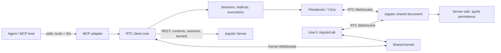

# Jupyter Collab MCP

Status: draft specification. Date: 2026-09-06.
Review resolution: [docs/REVIEW-RESOLUTION.md](docs/REVIEW-RESOLUTION.md).
This document describes the target behavior; implementation and compatibility
validation have not yet been completed. "Must" denotes a requirement for the
future implementation.

## 1. Decision

Build a long-lived Jupyter RTC client in TypeScript/Node.js with a local MCP
interface over stdio. It maintains a live CRDT replica of every open notebook,
accepts user changes, and reuses connections across tool calls. The skill
explains the collaborative workflow to the agent.

The client's lifetime provides the primary benefit. A CLI with a separate daemon
would also solve the problem, but would require custom IPC, daemon discovery,
and lifecycle management. For the first version, MCP is a convenient ready-made
integration of a long-lived process with the agent. The client core must remain
independent of MCP so a CLI can later be added on top of the same running process.

The local replica is the client's in-memory representation of the shared
document. It is not a separate notebook branch: accepted edits are immediately
sent to other participants. Variables and computation results live in the
Jupyter kernel; document state, kernel state, and LLM conversation context have
different lifecycles.

MCP does not itself provide a conversation session. In the 2026-07-28 protocol
revision, state across requests must be addressed by explicit identifiers; a
process may serve multiple conversations. The project therefore introduces its
own `session_id`, `notebook_id`, and `execution_id`, passed in tool arguments.
One stdio process per conversation may be a host configuration, but is not a
server invariant. [MCP: request state](https://modelcontextprotocol.io/specification/2026-07-28/basic#statelessness)

## 2. Findings about the existing client

The skill and source code of the existing Python project were examined. Paths
in the table are relative to
`claude-skill-jupyter-collaboration/src/jupyter_rtc_client/`.

| Observation | Evidence | Consequence |
| --- | --- | --- |
| The CRDT library is named `pycrdt`; version 0.12.44 is installed locally, and it provides Python bindings for Yrs | `pyproject.toml:21`, local package metadata | Yjs removes this native dependency from the new client |
| The user reported segfaults; no reproduction or stack trace was found | Examined source code and tests | Do not treat the cause of the crashes as established |
| A normal CLI cell invocation creates a new client and an empty `Doc` | `cli.py:280`, `client.py:79` | Every such invocation requires a new connection and initial synchronization |
| Initial synchronization transmits a state vector; subsequent updates are incremental | `sync.py:120`, `sync.py:234` | An empty replica has none of the state; preserve the replica across calls |
| `status`, `start`, `stop`, `kernels`, and `switch-kernel` operate without RTC | `cli.py:250` | Not every command in the old CLI downloads the document |
| The existence check loads contents without `content=0` | `client.py:153` | Do not download notebook JSON before obtaining the same document over RTC |
| The local version already waits for the matching `execute_reply` and IOPub `idle` | `kernel.py:161`, `tests/test_kernel.py:29` | Preserve this completion semantic |
| An error may be appended through a callback and again after the result; clear/update display are not handled | `client.py:368`, `client.py:404`, `kernel.py:195` | Use one output handler and separate tests for protocol messages |
| `run-all` and ranges rely on indices | `cli.py:828` | Capture the ID sequence and validate source revisions |
| `env` and `packages` execute code in the kernel | `cli.py:968` | Do not present them as passive reads |

Moving the client to JavaScript does not remove Python or `pycrdt` from the
Jupyter server. The official shared models have a Yjs-based JavaScript
implementation and a `pycrdt`-based Python implementation. This supports using
`@jupyter/ydoc`, but does not guarantee freedom from defects or automatic
compatibility between arbitrary versions.
[Jupyter YDoc](https://jupyter-ydoc.readthedocs.io/en/latest/overview.html)

## 3. First-version scope

The first version must cover normal collaboration: connect to an existing
server, open or create a notebook, start a kernel, read and edit cells, execute
code, and observe outputs and user edits.

| Old client capability | Decision |
| --- | --- |
| Server discovery, explicit URL selection, and listing notebooks and kernels | First version |
| Notebook creation and kernel start/stop/restart/switch | First version, as separate explicit actions |
| Code/markdown/raw, reading source and outputs, and adding/editing/deleting cells | First version |
| Exact text replacement and clearing outputs | First version |
| Editing cell/notebook metadata | First version, key-based operations with revisions |
| Changing an existing cell's type and editing attachments | Deferred; existing data must still be read and preserved |
| Executing one or more cells, all/to/from | First version through a captured ID list |
| Add/edit + execute | Two sequential calls; the edit remains if execution fails |
| Observing changes, saving, and plots | First version |
| `env`/`packages` | Recipes for visible diagnostic cells in the skill; dedicated tools later |
| Executing arbitrary code without a cell | Deferred; in the first version code is visible in the notebook |
| Moving cells through the API | Deferred until concurrent move/edit semantics are defined |
| Starting Jupyter and installing packages automatically | External setup; the first-version MCP uses an existing server |
| Widgets, comm targets, debugger, interactive stdin | Full support deferred; ordinary MIME outputs are required |
| HTTP MCP, shared daemon, on-disk replica cache, offline-first | Outside the first-version scope |

The first supported environment is a local stdio process and an existing
JupyterLab with `jupyter-collaboration`. An explicitly configured remote Jupyter
is also permitted: "local MCP" describes its connection to the agent; Jupyter
may be remote. A browser tab must not be required for kernel operation or
document persistence. Claude/Codex, stdio/HTTP, remote Jupyter, JupyterHub, and
Kubernetes scenarios are considered in
[docs/CONNECTIONS.md](docs/CONNECTIONS.md). HTTP, Hub authentication, and
special K8s adapters are designed as extensions; the scenario table does not
mean they are already implemented or included in the validated first version.

## 4. Architecture and state ownership



Core components:

- `ServerRegistry`: validated server configuration, with credentials excluded
  from responses.
- `SessionRegistry`: working sessions owned by the calling workflow.
- `NotebookConnection`: shared model, RTC provider, synchronization status,
  revisions, and a bounded change log.
- `KernelConnection`: one message receiver per kernel connection, routing by
  `parent_header.msg_id`, and an execution queue.
- `ExecutionRegistry`: executions, their states, and references to results.
- MCP adapter: tool schemas and result/error conversion.

A working session selects one server and may open multiple notebooks. Repeating
`notebook_open` for the same `fileId` in that session returns the existing handle
and does not create another `Y.Doc`/WebSocket. Concurrent opens are coalesced
into one operation. Replicas and cursors are independent across working sessions,
although the server document remains shared. Two sessions for one notebook
intentionally have two `Y.Doc` instances and two RTC WebSockets; each is fully
charged against memory and connection budgets. In stdio this is not a security
boundary between different people. A future shared HTTP adapter must bind
handles to an authenticated owner and validate that owner on every call,
including resource reads; the MCP transport session and `clientInfo` are not
used as proof of ownership.

All handles are opaque and belong to a specific service process. A supplied
`notebook_id` uniquely determines the server and working session; there is no
global "current notebook." Likewise, an `execution_id` addresses a specific
execution. After a restart, old handles return `HANDLE_EXPIRED`. The agent
explicitly reopens the document; unfinished code is not automatically retried.
Creation-tool descriptions and responses state lifetimes: sessions/notebooks
last until explicitly closed or the process exits; executions and their output
resources last until the working session closes. An unusable RTC handle retains
diagnostics until close, but no longer permits writes. Reopening the same file
in that working session still returns the existing handle, including a terminal
one; recovery therefore closes the terminal handle before opening and waiting
for a new ready replica. Active execution must first reach a terminal result or
be abandoned by an explicit caller decision. Active handles are not evicted to
admit new ones. This is application policy, and `HANDLE_EXPIRED` is its code,
not an MCP protocol code.
[MCP: Stateful Tools](https://modelcontextprotocol.io/specification/2026-07-28/server/tools#stateful-tools)

The kernel request queue is shared by all handles in this process with the same
`server_id + kernel_id`. It orders only this client's requests: a browser and
other processes may use the same kernel. The client does not promise an
independent variable namespace or a global execution lock. Invalidating a
shared connection must make a later acquisition independent of every lease on
the invalidated connection. A handle with an invalidated lease reacquires
before its next kernel operation; releasing an old lease must not close its
replacement.

`notebook_close` releases its RTC connection. `session_close` closes the
session's notebooks and subscriptions. By default, both refuse to close during
active execution (`EXECUTION_ACTIVE`): first finish the work or explicitly
interrupt it. Normal MCP shutdown does not stop kernels or Jupyter Server. On
EOF/SIGTERM, the process stops accepting executions, attempts to send buffered
updates within a short deadline, and releases connections. Abnormal termination
does not guarantee delivery of unsent changes or collection of later outputs.

## 5. Libraries and compatibility

Preferred stack: TypeScript with ESM, a supported Node.js LTS, the official
TypeScript MCP SDK, `@jupyter/ydoc`, `yjs`, `y-protocols`, `y-websocket`,
`@jupyterlab/services`, and a suitable Node WebSocket transport. Exact versions
are pinned by the first integration prototype in the lockfile and verified
compatibility table. Python is required by the server and Python kernel, but
not by the MCP process itself.

`@jupyterlab/services` provides a REST/kernel client and documents Node.js use.
The ready-made browser `@jupyter/docprovider` uses `window`, dialogs, and page
reloads, so it cannot be treated as a ready-made headless adapter. A small
module is needed to reconcile a Jupyter document session with `y-websocket`;
the CRDT algorithm and notebook model are not reimplemented.
[Jupyter services](https://jupyterlab.readthedocs.io/en/stable/api/modules/services.html),
[docprovider v5.0.2](https://github.com/jupyterlab/jupyter-collaboration/blob/v5.0.2/packages/docprovider/src/yprovider.ts)

This module must explicitly distinguish WebSocket message type `2`: it is
`messageAuth` in `y-websocket` and RAW in Jupyter. A RAW save request encodes
the string `save` and an ID; save and conflict responses contain JSON in a
var-string. The standard authentication handler is insufficient. The adapter
must intercept RAW before the authentication decoder or replace its handler;
save replies are correlated by ID. The browser docprovider installs a separate
listener on the current `provider.ws`, reinstalling it on every
`status: connected` for conflict handling. The headless adapter must likewise
handle the new socket after reconnect and remove old listeners.
[y-websocket 1.5.4](https://github.com/yjs/y-websocket/blob/v1.5.4/src/y-websocket.js#L23-L96)

The releases available during research were `jupyter-collaboration v5.0.2` and
`@jupyter/ydoc v4.1.1`. Their source code informed the design; running these
versions together has not been validated here. Support for all JupyterLab 4.x
versions must not be claimed solely from the interface version.
[Collaboration release](https://github.com/jupyterlab/jupyter-collaboration/releases/tag/v5.0.2),
[YDoc package](https://github.com/jupyter-server/jupyter_ydoc/blob/v4.1.1/javascript/package.json)

Versions of different packages in one release tag must be distinguished:

| Component | Confirmed constraint / selected candidate |
| --- | --- |
| `jupyter-collaboration` meta-package | 5.0.2 requires `jupyterlab>=4.6.0,<5.0.0` and `jupyter_server_ydoc>=3.0.2,<4` |
| `jupyter_server_ydoc` | The Collaboration v5.0.2 tag gives it its own version, 3.0.2; later dependency resolution may select a newer 3.x |
| JupyterLab | 4.6.3, which satisfies the meta-package constraint, is selected for source analysis and the first integration candidate |
| `@jupyter/docprovider` | 5.0.2 allows `y-websocket ^1.3.15`; the upstream yarn.lock resolves 1.5.4 |
| `y-websocket` | 1.5.4 is selected as the headless-adapter candidate to match the validated upstream lock; moving to 3.x requires separate validation |

Manifest constraints were established from source code; the complete
combination still requires an integration run. The release lockfile pins the
versions actually installed for every package.
[Meta dependencies](https://github.com/jupyterlab/jupyter-collaboration/blob/v5.0.2/projects/jupyter-collaboration/pyproject.toml#L32-L36),
[Server package version](https://github.com/jupyterlab/jupyter-collaboration/blob/v5.0.2/projects/jupyter-server-ydoc/jupyter_server_ydoc/_version.py#L1),
[Docprovider dependency](https://github.com/jupyterlab/jupyter-collaboration/blob/v5.0.2/packages/docprovider/package.json#L57-L59),
[Upstream lock](https://github.com/jupyterlab/jupyter-collaboration/blob/v5.0.2/yarn.lock#L16158-L16168)

PyPI/npm check as of 2026-09-06: the repository does not yet contain a package
manifest, installed dependency tree, or lockfile. The versions below describe
specification candidates. Python-client versions in §2 are only analysis data
from the old skill.

| Package | Current registry release | Use in the specification |
| --- | --- | --- |
| [jupyterlab](https://pypi.org/pypi/jupyterlab/json) | 4.6.3 | Candidate and source of UI behavior |
| [jupyter-collaboration](https://pypi.org/pypi/jupyter-collaboration/json) | 5.0.2 | Target release tag |
| [jupyter-server-ydoc](https://pypi.org/pypi/jupyter-server-ydoc/json) | 3.0.2 | Server package from the target tag |
| [jupyter-ydoc](https://pypi.org/pypi/jupyter-ydoc/json) / [@jupyter/ydoc](https://registry.npmjs.org/@jupyter/ydoc/latest) | 4.1.1 / 4.1.1 | Python/JS shared models |
| [jupyter-server](https://pypi.org/pypi/jupyter-server/json) | 2.21.0 | Candidate and current Contents manager source |
| [@jupyter/docprovider](https://registry.npmjs.org/@jupyter/docprovider/latest) | 5.0.2 | Protocol source; the complete browser package is not imported |
| [@jupyterlab/services](https://registry.npmjs.org/@jupyterlab/services/latest) | 7.6.3 | Candidate JS REST/kernel client |
| [yjs](https://registry.npmjs.org/yjs/latest) | 13.6.32 | Current candidate, within the upstream range |
| [y-websocket](https://registry.npmjs.org/y-websocket/latest) | 3.1.0 | Candidate 1.5.4 is deliberately older to match the upstream lock. Compatibility with 3.1.0 has not been investigated |
| [@modelcontextprotocol/server](https://registry.npmjs.org/@modelcontextprotocol/server/latest) | 2.0.0 | Current server SDK line; exact integration is validated in the prototype |
| [@modelcontextprotocol/sdk](https://registry.npmjs.org/@modelcontextprotocol/sdk/latest) | 1.30.0 | Separate 1.x SDK line, not the version of `@modelcontextprotocol/server` |

JupyterLab 4.6.3 and `jupyter-server-ydoc` 3.0.2 require Jupyter Server
>=2.19.0, so the 2.17.0 source was replaced with a 2.21.0 inspection. Release
currency and compatibility of the complete installation are validated
separately; automatically upgrading every major version at startup is not
supported.

The implementation compatibility table must record Node, the MCP SDK and
protocol revision, JupyterLab/Server/Collaboration/YDoc versions, execution
mode, and authentication type. API-presence checks must distinguish
incompatibility from 401/403, a missing document, and a transient network
error. Older MCP hosts are supported through the SDK, without a custom
handshake implementation.

| Collaboration | Observed semantics | First-version support |
| --- | --- | --- |
| Release tag v5.0.2; server package 3.0.2 | Checks the prior server session through the store; 1003 with JSON; 4400/4404/4500; RAW conflict | Target profile, requires integration validation |
| v2.1.5 (validated representative of 2.x) | Any server-session mismatch produces 1003 with a string; different initialization codes | Not claimed; requires a dedicated parser/adapter and tests before inclusion |
| Other 2.x, 3.x, 4.x, 5.x | Behavior cannot be inferred from the major version alone | Not claimed without validating the exact combination |

[v2.1.5 handling](https://github.com/jupyterlab/jupyter-collaboration/blob/v2.1.5/jupyter_collaboration/handlers.py#L217-L251)

## 6. Opening and synchronizing a document

1. Select a server by an explicit `server_id` or the single unambiguous
   discovery result. Multiple matching servers require an explicit choice.
2. Resolve the path relative to the Jupyter root; preserve `base_url`, including
   prefixes such as `/user/name/`. If a separate contents check is needed,
   perform it without loading content (`content=0`).
3. Obtain a document session through
   `PUT <base_url>/api/collaboration/session/<encoded-path>` with
   `{"format":"json","type":"notebook"}`.
4. Extract `fileId` and the collaboration `sessionId` from the response. Connect
   to room `json:notebook:<fileId>` at `api/collaboration/room`, passing the
   sessionId. This is neither a Jupyter kernel session nor an MCP working session.
5. Create an empty shared model, complete initial Yjs synchronization, verify
   that the notebook structure is accessible, and then return the handle. Do
   not populate the local replica from a JSON copy in parallel with RTC. After
   synchronization, set `state.document_id = roomname`, as docprovider does;
   this is the shared-document identifier also used by the server-side executor.
6. Keep the connection alive, apply remote updates, and send local updates. In
   Node, disable the provider's BroadcastChannel; the WebSocket is the exchange
   channel.

The document-session/room ordering and parameters follow
[requests.ts](https://github.com/jupyterlab/jupyter-collaboration/blob/v5.0.2/packages/docprovider/src/requests.ts)
and [yprovider.ts](https://github.com/jupyterlab/jupyter-collaboration/blob/v5.0.2/packages/docprovider/src/yprovider.ts).
Paths and parameters must be encoded according to that protocol, with tests
for Unicode, spaces, nested directories, and URL prefixes.

The first open still requires loading document state, including outputs. The
speedup applies to later operations; limiting an MCP response does not shrink
the `Y.Doc` itself. Reconnecting with a retained replica exchanges missing
updates by state vector. A new process starts with an empty replica.
[Yjs: document updates](https://github.com/yjs/yjs#document-updates)

Connection states are `connecting`, `syncing`, `ready`, `reconnecting`,
`conflict`, `closed`, and `failed`. Before readiness, reading an existing
snapshot marks it `stale`; new edits and executions return `NOT_READY` for a
recoverable connection or the retained terminal RTC code for `failed`. A closed
handle returns `HANDLE_EXPIRED`. The first version does not support offline
editing. Already-created updates remain in memory for reconnection.

Reconnection uses bounded exponential backoff with jitter, does not create
duplicate observers, and does not leave the prior `synced` flag true. For
v5.0.2, transitions are determined by these signals:

| Signal | Transition and action |
| --- | --- |
| Network loss of the WebSocket without a terminal signal | `ready → reconnecting → syncing → ready`; retain the replica, verify the same fileId, and await a new synchronization |
| 1003, JSON `reason: unknown_session` or `version_mismatch` | `failed`, error `RTC_SESSION_REJECTED`; disable auto-reconnect and never resynchronize this Y.Doc |
| 1003, `initialization_error`, or an unknown/unparseable reason | `failed`, `RTC_INITIALIZATION_FAILED`; retain only recognized reason names in diagnostics and do not guess compatibility |
| 4400 / 4404 | `failed`, respectively `RTC_BAD_REQUEST` / `NOTEBOOK_NOT_FOUND` |
| 4500 | Bounded initialization retries; after exhausting the budget, `failed`, `RTC_INITIALIZATION_FAILED` |
| RAW JSON `{"type":"conflict"}` | Emit `conflict`, then `failed` / `RTC_CONFLICT`; immediately stop sending updates and writing outputs to the shared document |

`sessionId` is the Jupyter process's global `SERVER_SESSION`. When it differs,
v5.0.2 checks the session store: an unknown ID is rejected; a differing
`jupyter-server-ydoc` version or document version known to both sides is
rejected; a compatible stored session is accepted. A Jupyter restart alone
does not imply rejection; `reloadable: true` in 1003 permits UI recovery, but
not resending our client's old replica. The checked `YDOC_SERVER_VERSION` comes
from the installed `jupyter_server_ydoc.__version__`; it is 3.0.2 in the
examined tag. The Collaboration meta-package version 5.0.2 is not used for this
check.
[Session handler](https://github.com/jupyterlab/jupyter-collaboration/blob/v5.0.2/projects/jupyter-server-ydoc/jupyter_server_ydoc/handlers.py#L247-L331),
[Session compatibility](https://github.com/jupyterlab/jupyter-collaboration/blob/v5.0.2/projects/jupyter-server-ydoc/jupyter_server_ydoc/utils.py#L168-L207)

A RAW conflict is associated with a `RuntimeError` containing `block parent`
during SYNC handling; for example, a client returns after eviction of a room
that was recreated from a changed file. Not every eviction must cause a
conflict. The server reports a rejected update; earlier applied edits may have
persisted. Retain a bounded snapshot/execution results for explicit recovery;
they must not be transferred automatically into a new model. The user closes
the unusable handle and reopens the current document. A changed file identity
also makes the handle unusable (`FILE_ID_CHANGED`); finding the same path does
not prove document identity.
[Room conflict](https://github.com/jupyterlab/jupyter-collaboration/blob/v5.0.2/projects/jupyter-server-ydoc/jupyter_server_ydoc/rooms.py#L316-L340)

### External file changes

MCP does not itself write externally to an open `.ipynb`, but it must observe
such writes: server v5.0.2 loads the file and applies `aset` to the live room.
In YDoc 4.1.1, unchanged cells may be retained and some fields are updated
granularly; other cells are recreated, and IDs absent from the file are
generated. Therefore, neither all old IDs should be assumed lost nor a matching
string ID treated as proof that the CRDT object was retained.

Observers update the ID index, revisions, and change log from actual changes.
Replacing a Y.Map, even with the same cell_id, invalidates old references,
subscriptions, the output generation, and queued execution targets not yet
sent. The queue captures local object identity when the job is accepted and
checks it again before opening an output generation or sending code; replacing
a cell with the same ID and source returns `CELL_REPLACED` without clearing its
outputs or sending it. Unchanged content revisions remain valid; structural revisions
and page cursors expire when structure changes. A change cursor remains valid
while its sequence is retained in the log. RTC does not attribute each such
edit to a specific external tool. A long-lived MCP client keeps the room alive:
the cleaner is scheduled when the last client leaves, and a connection cancels
it even if the browser tab is closed.
[Out-of-band handler](https://github.com/jupyterlab/jupyter-collaboration/blob/v5.0.2/projects/jupyter-server-ydoc/jupyter_server_ydoc/rooms.py#L342-L360),
[YDoc aset](https://github.com/jupyter-server/jupyter_ydoc/blob/v4.1.1/jupyter_ydoc/ynotebook.py#L331-L505)

Normal editing uses only the shared model. The Contents API is used to list and
create files; it does not overwrite an open `.ipynb`. A new notebook is created
through the server operation that allocates a new file (`newUntitled`, notebook
type) and returns the actual path. If `name` is supplied, the file is renamed
through Contents `PATCH` before the RTC room is opened. `name` is exactly one
`.ipynb` filename within `directory`, without `/`, `\\`, or other path
separators. The standard Contents manager supports naming; a separate atomic
no-replace check is not required.

`notebook_create` allocates an untitled file in `directory`, renames it when
`name` is present, and after success opens the document at the resulting path
and obtains its `fileId` through the collaboration session. The room is not
opened before a successful rename. If the server already chose the requested
name, no additional rename is needed.

After the first RTC synchronization of a file allocated by this exact
`notebook_create`, its sole initial code cell is considered a server placeholder
only if source and outputs are empty, metadata is empty or contains only the
server-default `trusted=true`, `execution_count=null`, `execution_state=idle`,
and no other nondefault fields exist. It is removed
before the response, so the first added cell gets index 0. Any difference or
more than one cell prohibits removal.

Rename response 409 maps to `ALREADY_EXISTS`; 403 maps to
`PERMISSION_DENIED`. After allocating an untitled file, both outcomes return
its actual path and `side_effects: applied`; the file remains on the server and
is not automatically deleted. If rejection occurred before allocation, that
stage determines effects. A timeout or disconnect after sending rename returns
`OPERATION_UNCERTAIN`: known old and target paths are returned for inspection,
their current state is not guessed, and the write is not retried automatically.

Both creation methods share a residual risk. In Jupyter Server v2.21.0's
standard manager, untitled-name allocation uses `exists` followed by `save`;
rename checks existence and then calls `shutil.move`. Tasks can switch between
the check and write/move. If another request or external writer creates the same
name in that window, one file may overwrite another. Atomicity against
concurrent writers is not promised; the window has not been measured. A
provider with atomic no-replace would strengthen the guarantee without changing
the tool sequence. A direct overwriting `PUT` to the chosen name is not used in
place of the create-and-rename workflow.
[Contents new_untitled/new](https://github.com/jupyter-server/jupyter_server/blob/v2.21.0/jupyter_server/services/contents/manager.py#L941-L1038),
[Async rename](https://github.com/jupyter-server/jupyter_server/blob/v2.21.0/jupyter_server/services/contents/filemanager.py#L1103-L1131)

### Delivery and persistence

An edit response distinguishes local application, socket transmission, and
server persistence. `ws.send`, `bufferedAmount == 0`, initial `synced`, and a
post-send delay do not prove that the server applied the edit or saved the
file. By default, the response reports `applied_locally`,
`delivery: sent|pending|unknown`, and `persistence: unconfirmed`; this accurately
states the client-side guarantee boundary.

`notebook_save` uses an acknowledgeable collaborative-provider operation when
supported by the validated version combination. The examined server has a RAW
save request with an ID and `success`, `skipped`, and `failed` responses.
`skipped` is not success; a timeout is not proof of write failure. An
acknowledgement establishes that a server save operation ran, but must not be
presented as proof that a particular local revision persisted without a
validated ordering of updates relative to save. The response separates these
facts (`save_status`, `revision_persistence: confirmed|unknown`).
[Server save handler](https://github.com/jupyterlab/jupyter-collaboration/blob/v5.0.2/projects/jupyter-server-ydoc/jupyter_server_ydoc/handlers.py)

The server also saves automatically after the `document_save_delay` debounce.
In v5.0.2, autosave is enabled if at least one nonempty awareness state has
`autosave: true` or omits the field; it is also enabled when there are no
states. MCP publishes `autosave: true`, so its presence preserves autosave even
when the browser publishes `false`. The skill explains this. Autosave may occur
without `notebook_save`, but waiting for the debounce does not confirm
persistence of a particular revision.
[Autosave decision](https://github.com/jupyterlab/jupyter-collaboration/blob/v5.0.2/projects/jupyter-server-ydoc/jupyter_server_ydoc/rooms.py#L370-L404)

## 7. Cells and concurrent edits

A cell is primarily addressed by its persistent `cell_id`. Its index is
returned for display and list construction, but is not used as a durable edit
or execution reference. A document ID is likewise not its path.

For each cell, `notebook_read` returns its ID, current index, type,
`source_revision`, `cell_revision`, `outputs_revision`, execution count, and a
short preview. Source, metadata, attachments, and outputs are read explicitly
and with limits. `source_revision` is an opaque digest of the exact source and
cell type; output changes do not alter it. `cell_revision` covers the entire
cell, while `outputs_revision` covers only outputs. The hash format is stable
within an API version; a short display hash is not used for stale-edit
protection. Shared `execution_state` and `notebook_metadata_revision` are also
returned. The latter covers notebook metadata, excluding internal state and
awareness.

Source replacement requires `expected_source_revision`. Full replacement is
applied as minimal changes to the existing Y.Text, preserving the cell object.
Exact substring replacement requires exactly one match, otherwise
`MATCH_NOT_UNIQUE`/`MATCH_NOT_FOUND`. Deletion requires
`expected_cell_revision`; clearing outputs requires `expected_outputs_revision`.
On mismatch, return `REVISION_CONFLICT` with the current revision and a bounded
preview, without changing anything.

Metadata changes use keyed `set_cell_metadata`/`delete_cell_metadata` with
`expected_cell_revision`, or `set_notebook_metadata`/
`delete_notebook_metadata` with `expected_notebook_metadata_revision`.
Untouched keys are preserved; cell type and attachments are currently only
read and preserved. Cell creation may select code/markdown/raw.

Insertion uses exactly one of `before_cell_id`, `after_cell_id`, or
`position: "end"`. A missing anchor returns `CELL_NOT_FOUND` without insertion.
A duplicate ID yields `CELL_ID_AMBIGUOUS` for an operation that addresses it or
uses it as an anchor; the first object must not be selected silently and IDs
must not be rewritten. Summary exposes duplicates and current indices for
diagnosis; other unambiguously addressable cells continue to work. A batch
containing an ambiguous target is rejected in full before mutation.

Ambiguity may disappear after server serialization/autosave: when distinct
cells share an ID, YDoc 4.1.1 assigns one a new UUID and writes it into the live
shared model. An exact duplicate is omitted from serialized output; this does
not promise removal of its Y.Map from the shared array. The client observes ID
changes, updates its index, and invalidates old targets, continuing to return
`CELL_ID_AMBIGUOUS` while the address remains ambiguous. The client does not
repair IDs itself.
[YDoc serialization deduplication](https://github.com/jupyter-server/jupyter_ydoc/blob/v4.1.1/jupyter_ydoc/ynotebook.py#L241-L284)

A `notebook_apply` batch is first validated in full against the current replica,
then applied in one synchronous Yjs transaction with no `await` between check
and write. The transaction groups observer changes; it is not a database
transaction with rollback. All expected errors must be detected before the
first mutation. If an unexpected error occurs after writing begins, the response
explicitly reports a possible partial result and requires rereading affected
cells.

Revision checks protect against changes already visible to the local client.
They are not distributed compare-and-swap: a remote edit not yet received may
merge with ours after validation. Yjs guarantees convergence but does not
define the meaning of concurrently rewritten code. The agent must reread
conflicting cells; the service does not promise an exclusive editor lock.

Moving cells is deliberately deferred: in the examined version,
`YNotebook.moveCells` clones and deletes the CRDT object. Preserving the string
ID does not preserve Y.Text history or resolve a race with concurrent edits to
the old object. Browser ordering changes must be observed correctly and
reflected in subsequent reads.
[YNotebook v4.1.1](https://github.com/jupyter-server/jupyter_ydoc/blob/v4.1.1/javascript/src/ynotebook.ts)

## 8. Execution and output

A kernel is bound through the Jupyter Sessions API to the selected notebook
path. An existing session is reused; ambiguous bindings return a selection
error. Reading or opening a notebook does not start a kernel. Start, switch,
restart, interrupt, and shutdown are explicit `kernel_control` operations.
Successful `start` and `switch` operations write the selected kernelspec
(`name`, `display_name`, `language`) into shared notebook metadata. After
`notebook_save`, it is present in the `.ipynb`; opening that path in JupyterLab
uses the bound session without showing the kernel picker again.
`notebook_execute` without a binding returns `KERNEL_NOT_BOUND` before changing
outputs or sending code. `kernel_status` returns the binding, channel state
(`connecting|connected|disconnected`), and separately observed execution status
(`unknown|starting|idle|busy|terminating|restarting|autorestarting|dead`) with
the observation time. `busy` from another request is reflected even though this
client does not write that request's outputs.
[Services status](https://github.com/jupyterlab/jupyterlab/blob/v4.6.3/packages/services/src/kernel/messages.ts#L586-L594)

In the first version's primary mode, `@jupyterlab/services` sends an
`execute_request` and the client writes received outputs into the shared model.
Each client-owned execution has exactly one writer. The browser receives these
outputs over RTC; IOPub messages from other requests are not duplicated into
their cells.

Modern docprovider has a separate server-side execution mode using
`POST /api/kernels/{id}/execute` with `cell_id` and `document_id`, enabled by
`serverSideExecution`. This is not a standard endpoint on every Jupyter server.
Supporting it requires a separate post-v1 adapter; the server then writes
outputs. The first version must not automatically switch modes after a timeout
or send both requests. An incompatible execution configuration returns
`UNSUPPORTED_EXECUTION_MODE` before execution.
[Executor selection](https://github.com/jupyterlab/jupyter-collaboration/blob/v5.0.2/packages/docprovider-extension/src/executor.ts),
[Server executor](https://github.com/jupyterlab/jupyter-collaboration/blob/v5.0.2/packages/docprovider/src/notebookCellExecutor.ts)

### Executions

`notebook_execute` accepts a nonempty ordered list of
`{cell_id, expected_source_revision}` and returns an `execution_id`. The
all/to/from operations construct this list from a `notebook_read` snapshot; a
cell inserted later is not automatically included. The list contains code
cells; an explicit target of another type returns `INVALID_ARGUMENT` before the
execution is accepted. Immediately before each cell is sent, its existence and
revision are checked again; a mismatch stops the queue before that cell runs.
The kernel request contains the validated source snapshot and supported
`cellId` metadata.

The first version sends cells sequentially: the next is sent after the previous
cell's reply + idle and another target check. There is no pipelining; the sent
cell displays `[*]`, while the unsent queue is visible through execution tools.
`stop_on_error=true` is passed to the kernel and by default stops this client's
queue; skipped cells are marked `not_sent`, while `aborted` denotes an actual
kernel response to a sent request.

Before sending, one shared-model transaction creates a new output-area
generation: outputs are cleared, `execution_count` becomes `null`, previous
`execution` timing metadata is removed, and `execution_state` becomes `running`.
This is an essential headless-client part of JupyterLab `clearExecution` and
launch behavior; clearing changes `outputs_revision` if output actually changed.
Counts from matching kernel messages accumulate in the execution; final count
and `idle` are written at completion while the client still owns the same
generation. Writing count early can clear `[*]` in JupyterLab, so it is not used
for a still-running cell. A stale execution cannot change the new generation's
outputs/state/count. In JupyterLab v4.6.3, `[*]` depends on shared execution
state; UI validation is required for the selected version combination.
[YCodeCell state](https://github.com/jupyter-server/jupyter_ydoc/blob/v4.1.1/javascript/src/ycell.ts#L777-L789),
[JupyterLab clearExecution](https://github.com/jupyterlab/jupyterlab/blob/v4.6.3/packages/cells/src/model.ts#L706-L714),
[JupyterLab prompt/execute](https://github.com/jupyterlab/jupyterlab/blob/v4.6.3/packages/cells/src/widget.ts#L1680-L1688),
[JupyterLab final count](https://github.com/jupyterlab/jupyterlab/blob/v4.6.3/packages/cells/src/widget.ts#L1820-L1823)

Execution states are `queued`, `running`, `succeeded`, `failed`, `cancelled`,
`interrupted`, and `unknown`. Python errors and kernel `aborted` have distinct
causes; by default an error stops the remaining cells. `wait_ms` limits only
how long the MCP response waits; computation may continue. `execution_get` can
wait for a state change and retrieve new output. A long computation does not
block reads, RTC updates, or kernel control.

Cell completion requires the matching `execute_reply` and IOPub `idle`, in
either arrival order. The output handler must support `stream`,
`execute_result`, `display_data`, `error`, `clear_output(wait)`, and
`update_display_data` by `display_id`, preserving MIME bundles and metadata.
Continued `stream` output appends as a delta to the existing shared `Y.Text`
rather than replacing the output for each chunk. Identical RTC reserialization
by a peer does not revoke the generation; differing outputs, execution count,
or state do. After completion, an independent browser observer sees the entire
stream, final count, and `idle`. Full revisions for a coalesced output event are
computed only when it is published or forcibly flushed, exactly once for the
last state; superseded pending chunks do not trigger full materialization.
`transient.display_id` remains in the router and is not stored as an ordinary
nbformat output field. The transport library handles binary kernel frames;
unsupported comm messages must not break the stream.
[Jupyter messaging](https://jupyter-client.readthedocs.io/en/stable/messaging.html)

Late outputs after `idle` continue updating their output area until superseded
by another execution, clear, delete, or close. Display IDs require routing
across different executions by this client. Every display target includes the
immutable shared-cell identity as well as notebook, cell ID, output generation,
and index, so deleting or renaming a cell and reusing its ID and generation
cannot redirect an old display update into the new cell or replace outputs
collected for the new cell's execution. Completion does not promise that
background threads will emit no later output.

### Races, interruption, and connection loss

- Each execution records a source snapshot, revision, kernel identity, and
  request msg_id. Editing during execution does not change sent code; the result
  is marked `source_changed` if current source differs.
- A cell deleted during execution is not recreated for outputs. The result
  remains available on the execution with `cell_deleted`.
- Each cell has an output-area generation. A new client-owned execution or an
  observed external execution/clear stops a stale stream from writing current
  outputs. In an ambiguous race, retain the result on the execution and stop
  writing the shared output area.
- `execution_cancel` removes unsent cells. A cell already sent may be queued by
  the kernel and is not safely cancelled. Interruption requires an explicit
  kernel interrupt, which affects the whole kernel and may affect another
  participant's code. MCP timeout and cancelled result waiting do not invoke it.
- Losing the kernel connection after send yields `unknown` without sufficient
  result evidence. Reconnection alone does not prove completion. An
  `execute_request` is not retried automatically.
- A graceful kernel shutdown may return an explicit abort/interruption reply
  for the request before the channels close. Only that request-correlated
  evidence permits `interrupted`; abrupt process loss without it remains
  `unknown`, and later queued cells remain `not_sent`.
- If RTC is lost while the kernel runs, bounded output collection continues in
  memory and delivery is unconfirmed. Later cells are not sent until recovery.
  After reconnect, outputs are applied only to the same live output area when
  that identity can be established.
- Observed restart/autorestart/shutdown/dead or binding changes, including
  browser-initiated ones, invalidate unfinished executions and old routes.
  Sent work without a proven result becomes `unknown`; unsent work becomes
  `not_sent` with `kernel_changed`/`kernel_dead`. Transport disconnection alone
  does not prove shutdown. If the event occurred during a disconnect and the
  same kernel_id does not prove process continuity, work remains `unknown` and
  is not retried. This client's restart/switch requires the expected
  `kernel_id`; a changed binding returns `KERNEL_CHANGED`. Restart does not
  clear outputs or run the entire notebook without a separate call. Restarting
  while the automatic kernel-info handshake is pending must not create an
  unhandled process-level rejection.

The first version uses `allow_stdin=false`: calls requiring interactive input
must fail clearly without hanging. The service performs no hidden code retries,
including for code with external effects.

## 9. MCP interface

Tools have static names, JSON Schemas for input/output, and effect descriptions.
Common kernel operations are grouped, and reads are separated from writes. No
tool depends on host-supported background notifications; ordinary tool calls
read results and changes.

| Tool | Primary arguments | Result/effect |
| --- | --- | --- |
| `server_list` | — | Safe descriptors for discovered/configured servers |
| `session_open` | `server_id?`, `label?` | `session_id`, lifetime, `next_request_id`; automatically select a sole server, without starting a kernel |
| `session_close` | `session_id` | Close the working session without shutting down kernels |
| `notebook_list` | `session_id`, `directory`, `cursor?` | Notebook files and available session information |
| `notebook_create` | `session_id`, `directory`, `name?`, `request_id` | Untitled → optional rename → open; actual path, fileId, notebook_id, changes_cursor |
| `notebook_open` | `session_id`, `path` | Reusable handle, lifetime, status, summary, and `changes_cursor` |
| `notebook_close` | `notebook_id` | Release the replica |
| `notebook_read` | `notebook_id`, `view`, `cell_ids?`, `cursor?`, `limits?` | Summary, source/metadata/attachments or outputs, revisions, page cursor, `changes_cursor` |
| `notebook_apply` | `notebook_id`, `request_id`, `operations[]` | Added IDs, new revisions, delivery state |
| `notebook_execute` | `notebook_id`, `request_id`, `cells[]`, `wait_ms?` | `execution_id`, state, initial results |
| `execution_get` | `execution_id`, `cursor?`, `wait_ms?`, `limits?` | State, new outputs, and content references |
| `output_read` | `output_id`, `cursor?`, `limits?` | Chunks of a specific output snapshot, MIME/size, next cursor |
| `execution_cancel` | `execution_id` | Cancel remaining unsent cells |
| `notebook_changes` | `notebook_id`, `cursor`, `wait_ms?`, `limit?` | Changes after the cursor or `CURSOR_EXPIRED` |
| `notebook_save` | `notebook_id` | Server save acknowledgement or uncertainty |
| `kernel_list` | `session_id` | Kernelspecs and running kernels, without executing code |
| `kernel_status` | `notebook_id` | Binding and observed kernel status |
| `kernel_control` | `notebook_id`, `action`, `expected_kernel_id`, `kernel_name?`, `request_id` | Start/interrupt/restart/shutdown/switch with explicit effects |

`notebook_read.view` is `summary`, `cells`, or `outputs`. For start, the expected
kernel ID may be `null`, meaning verified absence of a binding. Each action's
parameters occupy a separate input-schema branch. First-version
`notebook_apply.operations` are `add_cell`, `replace_source`, `replace_text`,
`delete_cell`, `clear_outputs`, `set_cell_metadata`, `delete_cell_metadata`,
`set_notebook_metadata`, and `delete_notebook_metadata`, with §7 rules.
Changing an existing cell type and writing attachments are deferred. The
summary snapshot and `changes_cursor` are captured consistently, without an
`await` between reading the model and recording the log boundary. `page_cursor`
and `changes_cursor` have distinct, noninterchangeable types. Tool responses in
a working session also return the current `next_request_id`. Descriptions for
`notebook_create`, `notebook_apply`, `notebook_execute`, and `kernel_control`
require sequential calls within each working session: send the next such call
after the preceding response, using its number. This constrains tool-call
acceptance; a returned `execution_id` may still be running. Reads, observation,
wait cancellation, and operations in different working sessions may proceed in
parallel. Interrupt remains available after obtaining an execution handle.

Example edit arguments and the subsequent execution call:

```json
{
  "notebook_id": "nb_A",
  "request_id": "17",
  "operations": [{
    "op": "replace_text",
    "cell_id": "cell_B",
    "expected_source_revision": "rev_before",
    "old_text": "df.head()",
    "new_text": "df.head(20)"
  }]
}
```

```json
{
  "notebook_id": "nb_A",
  "request_id": "18",
  "cells": [{"cell_id": "cell_B", "expected_source_revision": "rev_after"}],
  "wait_ms": 1000
}
```

Here, `17` is the previously returned `next_request_id`; `18` is returned after
accepting the edit. `rev_after` comes from the edit response. If execution does
not occur, the agent reports that separately; a successful edit is not rolled
back.

### Retries, errors, and response size

Deduplication is required for `notebook_create`, `notebook_apply`,
`notebook_execute`, and `kernel_control`. `request_id` is the canonical decimal
string of a positive 64-bit number increasing by one within the working session;
initial `next_request_id` is `"1"`. The client takes the number from that
session's latest response, without incrementing or reconstructing it from
memory. This is a service API number; JSON-RPC has its own ID. Two mutation
authors in one session must coordinate calls or use separate working sessions.
If the host sends concurrent calls, the same number with different payloads
returns `REQUEST_ID_CONFLICT`; the same number and payload is a replay; a later
number arriving before its predecessor returns `REQUEST_OUT_OF_ORDER`. An error
does not permit automatically reissuing an unknown operation under a new number.

The session retains the highest accepted number `H` and up to 4,096 compact
request receipts. A receipt contains the tool name, target handle, payload
digest, result/execution reference, established effects, and
`first_accepted_at` in UTC/RFC 3339. Under the session lock:

1. If the number is present, the same payload returns the prior result/same
   execution (or acceptance state) with `replayed: true` and unchanged
   `first_accepted_at`; a different payload returns `REQUEST_ID_CONFLICT`.
2. If absent but `<= H`, return `REQUEST_ID_EXPIRED` without execution. Removing
   a result never makes an old number new.
3. If `> H + 1`, return `REQUEST_OUT_OF_ORDER` with current `next_request_id`.
4. For `H + 1`, check preconditions and memory reservation, create the receipt,
   and increment `H` before the first effect. A pre-acceptance error does not
   consume the number; after acceptance it is consumed even on error or an
   uncertain result. The first response has `replayed: false` and its
   `first_accepted_at`. Replay does not update the initial acceptance time.

`replayed` indicates reuse of a stored receipt, not computation success. For
pre-acceptance rejection or no receipt, replay and time fields are absent;
`REQUEST_ID_EXPIRED` remains an explicit distinct outcome. Even replay returns
current `next_request_id = H + 1`, replacing the number stored in the old
response. The useful result and replay metadata are separate: the agent must
not report a new cell addition or launch from an old receipt. An intentionally
repeated identical operation uses a fresh session number. The service cannot
infer new intent from an already-used ID and payload.

When full, the registry removes its oldest completed receipt; active operations
are not evicted. A compact terminal receipt with `unknown` may expire, but `H`
still prohibits replay. If all slots contain active operations or the result
reservation does not fit, reject the new request with `RESOURCE_LIMIT` before
effects. `H` never decreases or resets; an exhausted range accepts no new
mutations. Results/errors expose `request_accepted: true|false|null`,
`next_request_id`, and retention policy. `null` means the receipt expired and
payload equality can no longer be established; on range exhaustion,
`next_request_id` is `null`. `REQUEST_ID_EXPIRED` does not permit retrying an
unknown effect under a new number: inspect the document/execution or obtain an
explicit user decision.

The no-resend guarantee for an accepted request applies within one live working
session with bounded result retention. Exactly-once behavior across restart,
new sessions, or Jupyter connection loss is not promised. Close/cancel are
repeatable against their target handle and send no code; repeated save may
persist newer state and is not declared deduplicated. Repeated `session_open`
creates another working session; `notebook_open` reuses a live handle.

Tool errors return `isError: true` and structured `code`, `message`,
`retryable`, and `side_effects: none|applied|unknown`; when applicable, also
`execution_id` and the current revision. The SDK handles malformed JSON-RPC. A
Python error is a specific execution result with state `failed`; MCP transport
may remain healthy. [MCP tools](https://modelcontextprotocol.io/specification/2026-07-28/server/tools)

The defaults below apply before a new call's effects. `side_effects` refers to
the document/file/kernel; number acceptance is reflected in `request_accepted`.
An established effect returns `applied`; an effect whose presence is unknown
returns `unknown`, even for a normally safe error. Repeating an accepted ID
returns its recorded result, and `retryable` does not authorize sending code
under a new ID.

| Code | `retryable` | Default `side_effects` | Condition/recovery |
| --- | --- | --- | --- |
| `INVALID_ARGUMENT`, `UNSUPPORTED_OPERATION` | false | none | Fix arguments/select a supported operation |
| `SERVER_NOT_FOUND`, `SERVER_SELECTION_REQUIRED` | false | none | Configure/explicitly select a server |
| `AUTH_REQUIRED`, `PERMISSION_DENIED` | false | none | Fix credentials/permissions outside tool arguments |
| `HANDLE_EXPIRED` | false | none | Explicitly open a new session/notebook; do not retry code |
| `NOT_READY` | true | none | Await readiness; for a terminal state, see the RTC code |
| `RTC_SESSION_REJECTED`, `RTC_CONFLICT`, `FILE_ID_CHANGED` | false | unknown | Stop sending the old document; recover explicitly |
| `RTC_BAD_REQUEST` | false | none | Fix the protocol profile/path |
| `RTC_INITIALIZATION_FAILED` | false | none | Reconnect budget exhausted or terminal cause; diagnose/open anew |
| `NOTEBOOK_NOT_FOUND`, `CELL_NOT_FOUND`, `CELL_ID_AMBIGUOUS`, `CELL_REPLACED` | false | none | Reread current structure and select the target |
| `REVISION_CONFLICT`, `MATCH_NOT_FOUND`, `MATCH_NOT_UNIQUE` | false | none | Reread/refine the edit |
| `CURSOR_EXPIRED` | false | none | Obtain a new snapshot and cursor |
| `ALREADY_EXISTS` | false | none | Choose another name; if a temporary file exists, return applied and its path |
| `UNSUPPORTED_EXECUTION_MODE` | false | none | A supported execution mode is required |
| `KERNEL_NOT_BOUND`, `KERNEL_SELECTION_REQUIRED`, `KERNEL_CHANGED` | false | none | Explicitly bind/select a kernel |
| `EXECUTION_ACTIVE` | false | none | Wait or explicitly decide whether to interrupt |
| `REQUEST_ID_CONFLICT`, `REQUEST_OUT_OF_ORDER` | false | none | Resolve payload/next number; the prior effect is not undone |
| `REQUEST_ID_EXPIRED` | false | unknown | Receipt lost; resending is prohibited |
| `RESOURCE_LIMIT`, `DOCUMENT_TOO_LARGE` | false | none | Release handles/raise the limit; number is not consumed before acceptance |
| `NETWORK_ERROR` | true | none | Only when an effectful request definitely was not sent |
| `OPERATION_UNCERTAIN` | false | unknown | Request sent, acknowledgement lost; do not retry the effect |
| `SAVE_FAILED` | false | unknown | Server reported failed; inspect state/cause |
| `INTERNAL_ERROR` | false | unknown | Unexpected error; reread affected state |

Python error, `aborted`, `interrupted`, and execution `unknown` are execution
states with reasons, not JSON-RPC errors. `save_status: skipped` is returned as
a distinct unconfirmed outcome, not disguised as success.

Summary and source are limited by cell count and bytes. Large outputs are
paged; responses always state `truncated`, available MIME types, sizes, and how
to continue. PNG/JPEG may be MCP image content; large objects may be resource
links with tool-based fallback reads. HTML/SVG are returned as data, and the
MCP process does not execute active content. Full base64 plots are not included
in every text response.

For its own `jupyter-output:` URIs, the server declares `resources: {}` and
implements `resources/read` and `resources/list` (the list may be empty; tool
links need not be listed). `output_id`/URI identifies a specific snapshot,
states its lifetime, and contains no credentials. Hosts without resource reads
use `output_read`; an unchanged snapshot is not recreated on every read.
`resources/read` has a separate limit: oversized objects are read in chunks via
`output_read` within response limits. Subscriptions/notifications are optional.
The `resource_link` type alone does not universally require a capability for
every external URL; one is required here because this MCP server serves the data.
`notebook_read(view: outputs)` and `execution_get` return `output_id` for
continued reading; an expired output snapshot returns `HANDLE_EXPIRED`. Lack of
host resource support does not make the execution result inaccessible.
[MCP resource links](https://modelcontextprotocol.io/specification/2026-07-28/server/tools#resource-links),
[MCP resources](https://modelcontextprotocol.io/specification/2026-07-28/server/resources)

Initial configurable limits are 100 cells per summary, 64 KiB of text per
response, up to 30 seconds of waiting per tool call, 10,000 notebook-log events,
32 open replicas, and 64 working sessions per process. These design values make
no claim about measured limits. Input request and compact receipt sizes are also
bounded and checked before effects; outputs are not copied into the replay registry.
Replicas, output buffers, and the deduplication registry have separate memory
budgets. On exhaustion, new operations/handles fail with `RESOURCE_LIMIT`;
active executions are not evicted, and completed receipts are released only
while retaining the no-reuse rule encoded by `H`. An oversized document returns
a size error rather than truncating the shared model. If output collection
exceeds its limit, the result is marked `output_incomplete`; the kernel is not
interrupted automatically.

Page-read cursors are bound to a revision: structural changes between pages
return `CURSOR_EXPIRED` to avoid missing or duplicating cells. Continuing an
unchanged large output must not retransmit chunks already returned. Text output
chunks and their cursors must begin and end on UTF-8 code-point boundaries. If
the next code point exceeds the requested byte budget, `output_read` returns
`RESOURCE_LIMIT` without advancing the cursor.
An `execution_get` cursor identifies both the mutable output-state version and
the delivered position within that version for every cell. If an already
delivered stream or display is updated, or the output area is cleared, the
next response sets `outputs_reset: true` and returns the current replacement
state (which may be an empty list). This remains observable after the job has
entered a terminal state.

The response byte limit applies to the final serialized `structuredContent`,
including truncation markers and continuation instructions. The adapter may
shorten an array only when it also moves the returned cursor to the last item
actually included. If one indivisible field or an array without such a
continuation cannot fit, the call returns `RESOURCE_LIMIT` instead of an
oversized or silently lossy success; the error identifies the measured and
configured sizes and retains an execution handle when one was accepted.

## 10. Observation and skill

`notebook_changes` returns a bounded event log covering add/delete,
source/metadata/output edits, reorder, kernel changes, and connection state.
Each event includes sequence, cell ID, new revisions, and change type. Source
and base64 are not copied into the log automatically. When a cursor expires,
the agent requests a new snapshot and observes from its new cursor.

The log reports state changes, not a full IOPub transcript. Frequent output
updates are coalesced per cell: a mutable pending record accumulates the current
`outputs_revision` and is published at most every 100 ms, on terminal execution
events, and before returning a snapshot/cursor. Published sequences never
change retroactively. Source/structure and generation boundaries are not lost:
pending outputs are published before such a boundary. Output bytes are read
separately. Snapshot issuance and log flush are coordinated so no change
disappears between snapshot and cursor. The 10,000 limit counts these records,
not kernel messages; overflow still explicitly returns `CURSOR_EXPIRED`.

Local transaction origin distinguishes client-owned changes from remote ones.
It does not prove which person made a remote edit. Yjs awareness presence shows
the assistant's name/color and disappears on disconnect; it is not proof of
authorship or a lock.

Background replica updates do not mean the LLM has seen a change. The skill
must require reading changes/revisions before dependent edits. MCP notifications
and resource subscriptions are optional enhancements for supporting hosts; they
do not replace explicit agent reads.

The new skill must be substantially shorter than the old CLI catalog and cover:

1. Selecting a server and opening a working session and notebook.
2. Reading the summary and required cells; using IDs and revisions.
3. Editing and visible notebook execution; obtaining the execution and result.
   Mutations with `request_id` are sequential per working session, with every
   number taken from the latest response. After compaction or losing the
   counter, first make a read-only call in that session, such as
   `notebook_read` or `kernel_list`, to retrieve current `next_request_id`. If a
   mutation response is lost, first repeat its original ID/payload to determine
   the result; do not reissue an unknown effect under a fresh number.
   `replayed: true` and `first_accepted_at` identify a previously accepted
   operation. A newly intended identical operation needs a fresh number; merely
   incrementing the counter cannot reconstruct lost intent history.
4. Reading plots, errors, and user changes.
5. Responding to revision conflicts, reconnects, and uncertain execution.
6. Distinguishing connection close, interrupt, restart, and kernel shutdown.
7. Never bypassing RTC by directly writing an open `.ipynb`; separate recipes
   validate the environment and install dependencies with project tooling.
8. An external Bash step to start JupyterLab when no server is available and
   the user requests it: first inspect the project-provided environment, then
   use its command or a standalone `uvx` recipe. MCP does not start Jupyter.
   For example, this prototype-validation candidate:

   ```bash
   uvx --from 'jupyterlab==4.6.3' --with 'jupyter-collaboration==5.0.2' \
     --with 'jupyter-server==2.21.0' \
     --with 'jupyter-server-ydoc==3.0.2' \
     --with 'jupyter-ydoc==4.1.1' jupyter lab --no-browser \
     --ServerApp.ip=127.0.0.1 --ServerApp.root_dir=/absolute/project
   ```

   Versions follow manifest constraints and source code; the example still
   requires the step-1 integration check. Preserve standard Jupyter
   authentication; do not copy the startup-log URL/token into an MCP response.
   Project environment determines the root path, kernelspec, and background
   launch mechanism.

The skill must not automatically install missing packages after `ImportError`,
silently execute administrative code, or stop another participant's kernel.
Such actions follow the user request and workspace rules.

## 11. Configuration and data protection

Server address and credentials come from process configuration or are read
internally from standard local Jupyter runtime descriptors. Discovery returns
only a secret-free URL, root, and safe identifiers. An explicit configuration
must not be replaced by an incidental local server.

Tool arguments never carry tokens. Credentials do not appear in stdout, logs,
exception messages, notebook links, or resource URIs. In stdio, stdout is
reserved for MCP and diagnostics use stderr. If WebSocket compatibility needs
a token query, that URL is also redacted before logging.
The installed package executable must start through the package manager's bin
symlink and preserve the same `--help`, `--version`, stdio, and `--http`
behavior as direct invocation of its target file.
[MCP stdio](https://modelcontextprotocol.io/specification/2026-07-28/basic/transports/stdio)

Support token authentication and validated HTTPS; cookie/XSRF and
JupyterHub-specific authentication are claimed only after adapter tests. Do not
disable TLS verification or send credentials to another origin on redirect.
Normalize paths relative to the Jupyter root and reject `..` traversal.

Code execution has the kernel's authority; MCP provides no Python sandbox.
Notebook source and outputs are input data. They do not authorize changing
service configuration or sending credentials.

## 12. Acceptance criteria

Validation runs against a separate temporary server with test notebooks. RTC
requires a second independent client; UI visibility requires a real JupyterLab
browser test. Checking only a local `Y.Doc` or tool-response text is insufficient.

| Area | Validated result |
| --- | --- |
| Stateful lifecycle | 100 sequential read/edit calls on one handle use one `Y.Doc` and one continuous RTC connection; no new full contents GET/initial sync per call |
| Repeated open | Sequential and concurrent opens of one document in a session return one handle |
| Separate conversations | Two session IDs in one stdio process do not mix handles, cursors, or execution results |
| Bidirectional RTC | A second client sees add/edit/delete/metadata/outputs without reload; MCP sees user changes |
| Concurrent edits | A known stale revision changes nothing; concurrent edits converge without promising distributed CAS |
| Identity and ranges | Browser insertion/reorder does not redirect planned execution to another cell; deleting the target stops the queue |
| Outputs | stdout/stderr, traceback exactly once, MIME metadata, PNG, `clear_output(wait)`, and update display match for an independent observer |
| Execution completion | Both reply/idle orders, aborted, Python error, late output, and edit/delete/rerun during execution |
| Interruption | Wait completion and MCP cancellation do not kill the kernel; explicit interrupt remains available during long execution |
| Shared kernel | Two notebook handles on one kernel create no competing receivers; another request's IOPub does not enter our cell |
| Network and restart | Reconnect retains the replica without duplicate observers; kernel disconnect does not retry code; incompatible server sessions do not overwrite documents |
| Session compatibility | Restart with a known compatible store entry accepts the old replica; unknown_session/version_mismatch/initialization_error in 1003, 4400/4404, and exhausted 4500 budget produce specified transitions/errors; terminal handles disable auto-reconnect |
| RAW and eviction | A `block parent` fixture after eviction/rebuild receives RAW conflict; the client stops sending the old Y.Doc and does not duplicate new cells. Save replies remain recognized after multiple reconnects and each socket has exactly one RAW handler |
| External write | With MCP live and browser closed, replace the file: unchanged cells retain revisions and changed cells update; removed IDs, replaced Y.Maps with the old ID, and reorder invalidate corresponding targets/cursors/output generations; external outputs are not overwritten |
| Shared execution | An independent browser sees clear/count=null/running then current count/state; late old-generation streams do not change new outputs/state; unsent cells retain prior output |
| External kernel | Execute, restart, and shut down the shared kernel from a browser: kernel_status shows external busy, terminating, and lifecycle; old unfinished executions are invalidated without retry; unbound launch returns KERNEL_NOT_BOUND without clearing outputs |
| Replays | Repeating a request ID does not create a second cell/notebook or execute twice; a different payload is rejected |
| Replay limit | Accept over 4,096 short operations: receipt memory remains bounded and an evicted number returns REQUEST_ID_EXPIRED without effects; concurrent equal numbers produce one execution, skipped numbers are rejected, and a full active registry rejects before effects |
| Replay and call order | Equal ID/payload returns replayed=true and original first_accepted_at; a fresh-number identical operation runs once. Different payloads under one number conflict; replay after newer operations returns current next_request_id. After context loss, a read-only call restores the number without mutation |
| Headless and persistence | Create, edit, and execute without an open browser; after acknowledged save, an independent file read contains expected data |
| Save uncertainty | skipped/failed/timeout and update/save races are not presented as confirmed persistence of a specific revision |
| Autosave | Validate awareness true/false/absent field and no states; MCP true persists after debounce without notebook_save, but is not confirmation of a particular revision |
| Document data | Read/edit preserves unknown metadata, markdown attachments, and untouched outputs |
| Tool coverage | Metadata operations validate revisions and preserve other keys; type changes/attachment writes are explicitly unsupported; a duplicate ID blocks only operations addressing it and batches containing them. Server ID changes during serialization update the index and old targets; an exact duplicate is not assumed removed from the shared array |
| Create name | The standard manager supports name. An existing target returns ALREADY_EXISTS with the actual untitled path and side_effects=applied, without opening a room; likewise for 403 after creation. Successful rename opens the final path/fileId. Timeout does not retry; tests do not claim provider TOCTOU is absent |
| Create placeholder | A fresh notebook omits its sole initial code cell only when source/outputs/count/state are entirely default, metadata is empty or only `trusted=true`, and no other fields or cells exist |
| Kernel metadata | After successful start/switch and save, kernelspec exists in the shared model and file; an open browser uses the session without another picker |
| Cursors and outputs | Open/read returns a valid changes_cursor without an event-loss window; wire-level journal pages advance only through returned events; long streams append deltas to one shared output and an execution cursor observes append/display-replacement/clear after initial delivery, including post-terminal changes; browser write-back does not leave `[*]`, revision materializes once when publishing/flushing the final coalesced state, published sequences are immutable; output_read continues a snapshot, and resources/read plus empty resources/list work without subscriptions |
| Limits | Large plots/output streams do not pollute every response; limits and expired cursors are explicit; input() does not hang |
| Cleanup and credentials | Closing handles releases observers/sockets while preserving the kernel; startup/reconnect/error never expose tokens |
| Test fixture isolation | Simultaneous disposable Jupyter stands use separate runtime and persistence state and can initialize RTC rooms independently |
| Release tooling | A clean install with the pinned pnpm version accepts the tracked build-script permission for esbuild without interactive approval, ignored-build errors, or creating new configuration files |

The benchmark compares cold open and warm read/edit on identical notebooks with
100, 1,000, and 10,000 cells, separately for source and large outputs. It records
connection and initial-sync counts, network bytes, p50/p95 latency, and memory.
The architectural success criterion is no repeated full synchronization on
warm calls. No numerical speedup is claimed in advance.

## 13. Implementation order

1. Validate headless imports, the document-session handshake, and one
   bidirectional edit through the official shared model. Validate RAW type-2
   dispatch, the post-reconnect listener, and shared execution_state in the
   browser; pin compatible versions and concrete close-code fixtures before the
   main lifecycle.
2. Implement lifecycle, repeated open, reads, revisions, mutations, and
   reconnect; validate with two independent clients.
3. Implement kernel routing, executions, and the output reducer; cover protocol
   orderings and races before exposing the user-facing MCP interface.
4. Add MCP schemas, deduplication, bounded outputs, changes, and configuration.
5. Validate the skill workflow in JupyterLab, browserless persistence, and the
   benchmark.

Until step 1 completes, the exact version set, headless-import behavior, and
server save details remain testable hypotheses. Correct browser-cooperative
execution is not claimed before browser integration tests. These checks refine
the implementation without changing the primary decision: a long-lived
JavaScript RTC client with explicit state ownership and MCP as its first
interface.

### External assertion headers

An operator profile may select `auth: {type: "header", name: "X-Jupyter-Access-Token"}`
with its existing `credentialRef`. The resolved value is sent verbatim in that
header for REST, RTC, and kernel handshakes, never as Jupyter `Authorization`
or a URL parameter. Omitted `auth` preserves Jupyter token authentication.
Credential headers must not follow cross-origin redirects; WebSocket and kernel
REST redirects are rejected. Credentials and their parser-generated fragments
must not appear in diagnostic bodies, exception causes, or inspected errors.
API, browser, and WebSocket base URLs are validated before discovery or
`server_list` can expose them. They must use the protocol appropriate to their
role and contain no user information, query, or fragment; a rejection does not
repeat the rejected URL.

By default all transports of one cached server client share a credential
snapshot. Updating a credential then requires restarting MCP, invalidating
handles without stopping kernels. A header-authenticated file profile may opt
into `credentialRefresh: "request"`: REST (including each same-origin redirect
hop) and each new RTC/kernel handshake read the current file. `credentialExpiry: "jwt"` additionally rejects an expired
or malformed JWT expiry and closes existing sockets at that credential's expiry;
`credentialExpiresAt` supplies a stricter absolute deadline. Decoding expiry is
only a rejection guard; it does not establish signature or identity validity.
Credential changes and reconnects never replay kernel execution automatically.

### Optional hosted HTTP transport

The main executable's `--http` mode authenticates every tools and resources
request and selects an operator-configured Jupyter server from the verified
identity, never from a caller-supplied principal, URL, or credential. Its tool
schemas, structured results, images, errors, and output resources preserve the
stdio contract.
It exposes a narrow OAuth proxy: dynamic client registration followed by an
authorization-code grant with mandatory S256 PKCE and a trusted upstream OIDC
login. Implicit and device grants are unsupported. Dynamic registration
accepts a nonempty array of nonempty grant-type strings containing
`authorization_code`, including clients that also request `refresh_token`, and
registers and returns only `authorization_code` unless refresh is enabled and
the client also requests `refresh_token`. Omitted grant types default to
`authorization_code`; malformed or unsupported-only requests are rejected.
Failed OAuth callbacks emit a bounded stderr diagnostic naming the upstream
exchange or identity-verification stage and an allowlisted reason code; unknown
errors use `unknown`. Diagnostics contain no raw errors, stacks, URLs, query
parameters, credentials, assertions or claim values, and do not use stdout.
Identity diagnostics distinguish signature, issuer, audience, expiry, missing
or rejected email verification, email domain and provisioned-user failures.
External callback errors remain generic and authentication checks are unchanged.
Upstream code exchange uses the configured public callback URI, including its
HTTPS scheme and base path, with only the incoming callback query copied onto
it. Listener URLs and forwarded headers cannot change that URI; state, nonce
and PKCE validation remain mandatory behind TLS-terminating proxies.
Registrations, transactions, one-time codes, local tokens and upstream refresh
credentials are encrypted at rest. One-time codes are consumed atomically and
codes/access tokens never outlive their signed upstream ID token. Redirects are checked against current operator policy at
registration, authorization, and callback time. Upstream OIDC discovery, JWKS,
and token requests never follow redirects. An inconclusive identity-verification
failure denies the request but does not destroy a still-live local grant.
An identity derived from an email claim requires the signed `email_verified`
claim to be boolean `true` by default. An operator may explicitly set
`JUPYTER_MCP_ALLOW_MISSING_EMAIL_VERIFIED=true` to also accept an absent claim
from the configured trusted issuer. The setting accepts only `true` or `false`
and defaults to `false`; it never permits explicit false, null or malformed
claim values. Signature, issuer, audience, expiry, email-domain and provisioned
user checks remain mandatory before a worker slot or process is allocated.

`JUPYTER_MCP_ENABLE_REFRESH=true` enables genuine upstream OIDC renewal and
rotating opaque downstream refresh tokens; the default is false. Only the
upstream authorization request adds `offline_access`; downstream scopes remain
`openid email`. A new signed ID token is required on every renewal and must
retain issuer, subject and mapped user, with unchanged nonce/authentication time
when supplied. Signature, audience, time, email and provisioning checks apply
again. A missing replacement upstream refresh token retains its predecessor;
an absent ID token never permits reuse of an expired assertion.

Each login has a persisted client-bound grant family with an absolute deadline
(`JUPYTER_MCP_REFRESH_GRANT_TTL_SECONDS`, default eight hours). Rotation never
extends that deadline or an already issued access token's own expiry. Redis
atomic compare-and-swap admits one upstream renewal. An encrypted ten-second
receipt lets concurrent requests with the same refresh token and authenticated
client receive the exact same credential pair, with remaining lifetime, without
another upstream request. This deliberately tolerates replay only within that
short immediate-predecessor window; later consumed-token reuse revokes the
family and its workers. Client binding is checked before consumption or
revocation. Ambiguous upstream failure or an abandoned in-flight renewal fails
closed and requires login, rather than retrying a potentially consumed upstream
token. Family state, receipts and consumed-token references survive restart in
encrypted storage. Existing registrations and unexpired legacy access records
remain usable; obtaining refresh permission requires a new compatible
registration/login, not conversion of an old access token.

A refresh-enabled worker and its handles belong to one server-issued login grant
plus issuer, subject and Hub user. Verified renewal replaces its private
credential atomically under the request lease and preserves handles. Monotonic
generations prevent queued older requests from overwriting a newer credential;
queued requests still cannot outlive their own access-token deadline. Other
logins never borrow that credential. Legacy workers remain assertion-generation
bound. HTTP disconnection does not evict workers. An assertion-expiry gap may
retain refresh-worker handles until the absolute grant deadline, but expired
credentials cannot send REST requests, start handshakes or keep sockets sending.
Fresh credentials reconnect existing handles without replaying execution.
Revocation leaves a deadline-bounded tombstone so already-verified queued
requests cannot recreate the worker. Worker cleanup leaves
Jupyter kernels running and never replays an interrupted request. Retirement
and shutdown attempt every owned worker independently; a failed close remains
owned and quarantined for retry, never available for another lease; a
replacement can be allocated only after the failed cleanup succeeds. A failed
expiry sweep cannot skip worker or authentication cleanup during shutdown.

Browser requests to the advertised MCP endpoint receive origin-specific CORS
headers after origin validation. Its preflight advertises every header used by
the Streamable HTTP transport, and authentication failures remain readable by
the allowed browser origin.

Global and per-principal capacity limits reject new workers without evicting
existing ones. Credentials remain in private ephemeral files; subprocess
arguments, environment, logs, and MCP responses do not contain the assertion.

Cloudflare Access mode disables the origin's OAuth endpoints and validates each
MCP request's signed Access assertion against an explicit team issuer, application
audience, expiry, email policy and provisioned-user allow-list. Bearer tokens,
unsigned forwarded identity headers and transport session identifiers never
substitute for that verification. Only the exact verified assertion reaches
Jupyter. This mode does not require local OAuth secrets or an OAuth Redis store.

Access mode uses sessionful Streamable HTTP. Each successful initialize creates
a server-generated session bound to issuer, subject and mapped username. A
different principal cannot use it, and independent initializations for the same
principal cannot share workers or handles. Assertion rotation preserves a
session's worker and atomically updates its credentials under the worker lease.
Expired assertions cannot authorize requests. Missing or unknown sessions require
initialization; DELETE and configured absolute session expiry retire the owned worker.
Restart loses process-local handles, but does not invalidate Cloudflare-managed
OAuth grants. Session allocation obeys global/per-principal capacity limits, and
invalid initialization attempts do not retain capacity.
Abandoned sessions expire after a bounded idle interval even when clients omit
DELETE, returning their capacity. Authenticated requests reset that interval;
in-flight requests cannot be evicted for idleness. Operators may disable the
absolute session lifetime with `ACCESS_SESSION_TTL_SECONDS=0`; then continued
authenticated activity preserves the worker and handles regardless of session
age. This retention never extends an assertion or Cloudflare login lifetime:
expired credentials cannot authorize requests or downstream traffic. Explicit
close and idle expiry prevent late in-flight work from resurrecting the session,
without retaining permanent revocation records. When an absolute deadline is
configured it still applies; expired handles require initialization and reopen.
