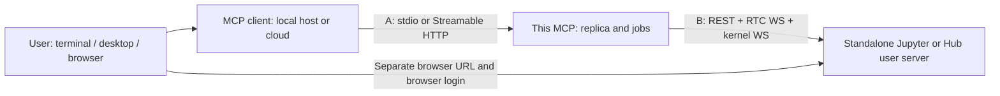
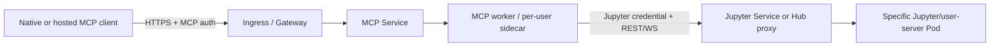

# Claude/Codex connection scenarios for Jupyter Collab MCP

Source review date: 2026-09-06. Status: proposed extension to the
[main specification](../SPEC.md).
The connections described here were researched from documentation and source
code: neither this project's MCP nor any of the listed deployments has yet been
implemented or tested.

## 1. Three execution locations and two independent connections

The MCP client location, this project's MCP server location, and the Jupyter
address must be selected independently. `stdio`/HTTP describes only the first
connection. Even a local stdio MCP accesses remote Jupyter over HTTP(S) and two
WebSocket connections: one for RTC and one for the kernel. Conversely, an HTTP
MCP may run on the same laptop as the agent.



In connection A, `localhost` refers to the MCP client's machine; in connection
B, it refers to the MCP server's machine/container. In a browser link, it refers
to the user's computer. These addresses may identify three different hosts. For
a cloud connector, a VPN on the laptop does not create a route from the cloud.

Credentials are separated in the same way: credential A authorizes calls to the
MCP; credential B gives the MCP access to Jupyter. Authentication in a Jupyter
browser session does not automatically pass a cookie or token to the Node.js
process.

Proposed baseline options:

- Personal agent and reachable remote Jupyter: a stdio MCP on the agent's
  machine, with direct HTTPS/WSS or SSH forwarding to Jupyter.
- Large notebooks and a slow WAN: place the MCP near Jupyter and reach it using
  stdio over SSH or HTTP. CRDT state and large outputs remain close to Jupyter,
  while bounded tool responses cross the WAN. This is an expected placement
  effect that still needs to be measured.
- Cloud Claude connector: an HTTPS MCP reachable by the connector and protected
  by its own authentication; Jupyter may remain private behind that MCP.
- JupyterHub: begin with direct access to an already-running user server using
  a user token; starting servers through the Hub API and sharing one MCP among
  multiple users require separate contracts.

## 2. Client capabilities

The table distinguishes connection methods within each application. Claude
Desktop alone has materially different local and cloud paths.

| Client / mode | Connection A | Where it originates | Consequence |
| --- | --- | --- | --- |
| Claude Code, native MCP config | stdio, Streamable HTTP; legacy SSE | Claude Code process host | Its loopback, LAN, and VPN are reachable |
| Claude Desktop, local config or MCPB | stdio | User's computer | The local MCP can access private/remote Jupyter itself |
| Claude Desktop, custom remote connector | Streamable HTTP; legacy SSE | Anthropic cloud | This is not an HTTP client on the laptop's network |
| Claude web/mobile, custom connector | Streamable HTTP; legacy SSE | Anthropic cloud | Requires a cloud-reachable MCP endpoint or supported tunnel |
| Claude web/mobile through Remote Control | MCP remains with Claude Code | Host running Claude Code | Web/mobile acts as the interface; the MCP need not be published |
| Codex CLI / IDE / desktop, Codex host configuration | stdio, Streamable HTTP | Selected Codex host | Settings are shared by clients on that host; transfer between machines is not assumed |
| Codex with `experimental_environment = "remote"` | stdio through an available remote executor | Remote execution environment | Experimental; remote placement for HTTP is not implemented |
| Hosted ChatGPT Work / web | Remote MCP tools through plugins | Hosted integration | Does not read local `~/.codex/config.toml`; this path is separate from native Codex |

Claude Code supports HTTP OAuth and headers; local Desktop documents stdio. For
Desktop, access to a private HTTP MCP can be provided by a local stdio bridge or
MCPB. A direct `url` field in Desktop JSON is not assumed here to be a supported
replacement for that path.
[Claude Code MCP](https://code.claude.com/docs/en/mcp),
[MCPB](https://claude.com/docs/connectors/building/mcpb)

The execution location of hosted connectors is confirmed by
[Claude custom connectors](https://support.claude.com/en/articles/11175166-get-started-with-custom-connectors-using-remote-mcp).
Remote Control keeps execution and the MCP on the Claude Code host; it requires
an appropriate claude.ai login and feature availability and is not an API-key
mode.
[Remote Control](https://code.claude.com/docs/en/remote-control)

Codex documents stdio, HTTP bearer/OAuth, and shared local-host configuration.
Hosted ChatGPT web uses a different path: plugins. Experimental remote stdio is
not a promise that every configuration is supported in Codex Cloud: executor
availability, configuration, and credential provenance must be checked for the
specific environment. In particular, an HTTP request must not be assumed to
originate from the remote executor.
[OpenAI: MCP](https://learn.chatgpt.com/docs/extend/mcp),
[OpenAI: configuration reference](https://learn.chatgpt.com/docs/config-file/config-reference)

### Hosted Claude constraints

A standard custom connector connects to an HTTPS address reachable from
Anthropic. MCP Tunnels is documented for private MCPs, but it is an Enterprise
research preview available by request. It must not be assumed to be available
to a given account. It requires Streamable HTTP and separate OAuth setup; an
outbound tunnel does not replace MCP authentication.
[MCP Tunnels](https://claude.com/docs/connectors/mcp-tunnels/overview)

Hosted connectors support OAuth. Static header authentication is also
documented, but as a beta for a limited set of organizations: an administrator
configures the headers and the credential is shared across the organization.
Such a token cannot distinguish that organization's users at this MCP.
Individual identity for every calling user is required for personal access to
different Hub user servers.
[Claude OAuth](https://claude.com/docs/connectors/building/authentication),
[Header auth](https://claude.com/docs/connectors/custom/remote-mcp#authenticating-with-request-headers)

## 3. Placement matrix

"Native client" below means Claude Code or a Codex host directly connected to
the MCP. Local stdio also applies to Claude Desktop. Hosted connector means the
cloud path from the previous table. HTTP options use the main executable's
optional authenticated `--http` mode; the table still includes deployment
combinations that have not all been validated end to end.

| ID | MCP client → MCP | MCP → Jupyter | Reachability and use |
| --- | --- | --- | --- |
| T01 | Laptop → stdio on laptop | Standalone on laptop | Baseline scenario; local discovery, kernel, and files are local |
| T02 | Laptop → stdio on laptop | Remote standalone over HTTPS/WSS | Access from the laptop's network and a Jupyter credential are sufficient |
| T03 | Laptop → stdio on laptop | Standalone through SSH forward | Jupyter listens on remote loopback; the MCP connects to the local end of the tunnel |
| T04 | Laptop → stdio on laptop | Hub user server | Explicit full server URL and user access; Hub control API is optional |
| T05 | Laptop → stdio over SSH → remote MCP | Jupyter near the MCP or Hub | No MCP HTTP endpoint is needed; an installed remote launcher and SSH are required |
| T06 | Agent running on remote host → stdio there | Standalone/Hub reachable by remote host | `localhost`, env, credentials, and discovery refer to the remote host |
| T07 | Native client → HTTP on laptop | Standalone on laptop | One service can be reused across calls/clients; lifecycle and local HTTP auth are required |
| T08 | Native client → HTTP on laptop | Remote standalone or Hub | The path to Jupyter still uses the laptop's network, but transport A is now HTTP |
| T09 | Native client → HTTP MCP in remote/VPN network | Standalone near the MCP | Jupyter need not be published; RTC latency remains within the remote network |
| T10 | Native client → remote HTTP MCP | Another remote standalone or Hub | Both hops must be reachable; laptop access to the Hub does not by itself help the MCP |
| T11 | Hosted Claude → HTTPS MCP | Remote standalone or Hub | The MCP is externally reachable while Jupyter may remain internal; user-to-credential binding occurs at the MCP |
| T12 | Hosted Claude → protected ingress/tunnel → MCP on laptop | Jupyter on laptop or remote | Requires a working ingress or available MCP Tunnels; laptop sleep interrupts the service |
| T13 | Any client → remote HTTP MCP | Jupyter on user's laptop | Works only with a route from the MCP to the laptop, such as VPN/reverse tunnel; remote `localhost` is unsuitable |
| T14 | Native/hosted client → HTTP MCP inside Hub user deployment | Its user server | Personal service/sidecar; requires a separate MCP endpoint and compatible inbound auth, not merely the Hub login page |

T05/T06 also apply when the user prefers a browser/mobile UI while the agent
actually runs on another host. For Docker/containers, "nearby" does not imply a
shared loopback: a shared network namespace or explicit service address is
required. Tunnel A to the MCP does not create tunnel B from the MCP to the
laptop.

### SSH: two different solutions

In T03, Jupyter is tunneled while the CRDT replica remains on the laptop:

```sh
ssh -N -T -o ExitOnForwardFailure=yes \
  -L 127.0.0.1:18888:127.0.0.1:8888 analyst@compute.example.org
```

This is an example command for manual invocation, not an applied configuration.
Port `8888` must be the verified Jupyter address on the remote host. The MCP
uses `http://127.0.0.1:18888/` with the original base path when it is not `/`.
SSH protects the transport but does not remove the need for Jupyter
authentication. Do not use a shared public bind, disabled TLS verification, or
`StrictHostKeyChecking=no`.

In T05, the SSH process transports stdio and the replica resides near Jupyter:

```sh
ssh -T -o BatchMode=yes analyst@compute.example.org \
  /opt/jupyter-collab-mcp/bin/start-stdio
```

`start-stdio` is a proposed launcher that does not yet exist in the repository.
It must configure the remote environment and write only MCP traffic to stdout.
Shell banners, a TTY, and merged stderr break stdio. In this option, Jupyter
credentials are configured on the remote host; local environment variables and
an untracked `.envrc` are not transferred automatically. An SSH disconnect ends
this transport connection; job continuation afterward cannot be promised
without a separate service lifecycle.

## 4. Client configuration examples

These examples mix the implemented package CLI with deployment-specific
launcher paths, hostnames, and secret names. Proposed launchers must not be used
until the corresponding executable and server exist; the npm-based local stdio
configuration in the root README is the supported package entry point.

### Codex: stdio and any reachable Jupyter

```toml
[mcp_servers.jupyter]
command = "/opt/jupyter-collab-mcp/bin/start-stdio"
env_vars = ["JUPYTER_COLLAB_PROFILE", "JUPYTER_SERVER_TOKEN"]
startup_timeout_sec = 30
tool_timeout_sec = 45
```

The profile selects upstream Jupyter; Codex placement is configured separately.
The configuration passes environment-variable names; secret values are not
present here. `command` and its environment must exist on the actual MCP host,
including during GUI startup. For remote stdio through a supported executor,
the fields may look like this:

```toml
[mcp_servers.jupyter_remote]
command = "/opt/jupyter-collab-mcp/bin/start-stdio"
experimental_environment = "remote"
env_vars = [
  { name = "JUPYTER_COLLAB_PROFILE", source = "remote" },
  { name = "JUPYTER_SERVER_TOKEN", source = "remote" }
]
```

This option requires a corresponding remote environment. A standalone Codex
CLI started over SSH on a server uses standard stdio configuration without
`experimental_environment`: that server is already its local host.
[Codex stdio fields](https://learn.chatgpt.com/docs/extend/mcp#stdio-servers)

### Codex: HTTP on a laptop or remote host

```toml
[mcp_servers.jupyter_http]
url = "http://127.0.0.1:8765/mcp"
bearer_token_env_var = "JUPYTER_MCP_ACCESS_TOKEN"
tool_timeout_sec = 45
```

For remote use, replace the URL with `https://mcp.example.org/mcp`; the Jupyter
URL remains in the MCP's server-side profile. `JUPYTER_MCP_ACCESS_TOKEN` is
token A for the MCP; Jupyter token B is configured separately. If the server
uses OAuth:

```sh
codex mcp add jupyter_oauth --url https://mcp.example.org/mcp
codex mcp login jupyter_oauth
```

The general configuration reference also permits `env_http_headers` and a local
`http_headers_helper`. The helper is not transferred automatically to a remote
executor. A loopback OAuth callback belongs to the host where login occurs. A
remote CLI requires a reachable callback, correctly configured
forwarding/ingress, and the exact registered redirect URI; it cannot be
arbitrarily replaced with the laptop's address. CLI syntax was additionally
checked against the help output of installed `codex-cli 0.153.4`.
[Codex HTTP/OAuth](https://learn.chatgpt.com/docs/extend/mcp#streamable-http-servers)

### Claude Code: stdio, HTTP, and OAuth

```sh
claude mcp add --transport stdio jupyter \
  -- /opt/jupyter-collab-mcp/bin/start-stdio
```

For HTTP, `.mcp.json` permits environment-variable substitution:

```json
{
  "mcpServers": {
    "jupyter": {
      "type": "http",
      "url": "https://mcp.example.org/mcp",
      "headers": {
        "Authorization": "Bearer ${JUPYTER_MCP_ACCESS_TOKEN}"
      }
    }
  }
}
```

For OAuth instead of a bearer header:

```sh
claude mcp add --transport http jupyter_oauth https://mcp.example.org/mcp
claude mcp login jupyter_oauth --no-browser
```

`login --no-browser` is documented starting with Claude Code 2.1.186; manually
exchanging the callback over SSH requires an interactive terminal. On an older
version, use its documented authorization path and verify that the command is
available for that version. [Claude Code MCP](https://code.claude.com/docs/en/mcp)

### Claude Desktop and hosted connector

For local stdio, add an entry to the existing `claude_desktop_config.json`:

```json
{
  "mcpServers": {
    "jupyter": {
      "command": "/opt/jupyter-collab-mcp/bin/start-stdio",
      "args": []
    }
  }
}
```

Restart Desktop completely after the change. The launcher obtains credentials
from a preconfigured secure source; `${VAR}` from Claude Code must not be
treated as supported Desktop-config interpolation.
[Local MCP in Desktop](https://support.claude.com/en/articles/10949351-getting-started-with-local-mcp-servers-on-claude-desktop)

For the hosted option, configure a custom connector with an HTTPS URL and then
use Connect/OAuth. Configuration in Desktop does not change the request's cloud
origin. In Team/Enterprise, connector availability and addition also depend on
workspace settings. [Custom connector setup](https://support.claude.com/en/articles/11175166-get-started-with-custom-connectors-using-remote-mcp)

## 5. What HTTP changes in this server

The HTTP adapter reuses the same notebook tools and RTC core. Creating a
separate `Y.Doc` for every POST would eliminate the original benefit. The
registry must live outside the request handler; closing an HTTP/SSE response
ends the wait/subscription but does not delete the replica, repeat execution,
or shut down the kernel.

For the first HTTP implementation, use one long-lived worker per deployment or
per user. Load balancing among independent workers without routing by handle
owner is unsuitable. Horizontal scaling requires a separate router/registry
keyed by an explicit application session ID; a sticky connection and client IP
are not a sufficient contract.

| Contract | HTTP extension requirement |
| --- | --- |
| Ownership | Every working session, notebook, execution, resource, and cursor is bound to a verified principal |
| Authentication | Verify it on every HTTP request, including result and resource reads |
| Handles | Knowing another user's handle does not grant access; lookup verifies ownership before reading data |
| Servers | `server_list` returns only profiles authorized for the principal; no shared credentials belonging to another user |
| Pools | A connection pool does not combine different upstream identities merely by URL/kernel ID |
| Retry | Verify the principal before lookup, then apply `(application session, request_id)` and the operation/target/payload digest from SPEC; another user's request ID does not reveal a result |
| Context creation | Automatic per isolated worker; MCP clients open notebooks directly and send no working-session ID |
| Lifecycle | Explicit close plus a bounded lease for abandoned idle sessions; HTTP disconnect is not close |
| Active work | An idle lease does not destroy an active job; its retention has a separate bounded budget and visible status |
| Restart | When worker state is lost, old handles expire; jobs are not retried automatically |
| Token refresh | Every exact credential generation owns a separate worker; a new token does not inherit old handles, while an old still-valid grant retains its own worker |

Core request IDs form a sequence within a connection context across all servers, with a bounded
result cache and retention of the high-water mark of accepted numbers as
specified in SPEC. An evicted old ID does not run an operation again.
Core mutating tool calls within one session are sent sequentially using the
number from the latest response; after context loss it is recovered with a
read-only call. `replayed: true` with `first_accepted_at` denotes a previously
accepted operation. Even a replay returns the current `next_request_id`; a new,
intentional execution of an identical payload requires a fresh number. The
computation itself need not finish before the next tool call when its execution
handle has already been returned. Independent sessions and reads may proceed in
parallel.

The implicit context lasts as long as its isolated worker. Individual HTTP
request completion is not context closure. Managed Access transport termination
or idle expiry stops its worker; stdio EOF/SIGTERM releases the process context.
Notebook mutations use the context-wide request ledger to recover lost responses.

Do not use legacy `Mcp-Session-Id` as identity or an ownership basis. The
2026-07-28 revision does not create it; the GET/DELETE legacy session endpoint
and `Last-Event-ID` are not universal either. Support for older clients remains
the responsibility of the official SDK, with a separate compatibility matrix.
Streamable HTTP is the preferred new transport; HTTP+SSE remains for legacy
compatibility.
[MCP HTTP transport](https://modelcontextprotocol.io/specification/2026-07-28/basic/transports/streamable-http)

A local HTTP deployment listens on `127.0.0.1` by default, validates an allowed
Origin when the header is present, and requires a separate MCP credential. A
remote deployment uses HTTPS ingress, correct Authorization forwarding, body
limits, sufficient timeouts, and disabled SSE buffering. On connection B, the
proxy separately supports Upgrade for RTC and kernel WebSockets. These are
different routes: SSE support in front of the MCP does not prove that
WebSockets to Jupyter work.

## 6. Two authentication layers

| Placement | Credential A: client → MCP | Credential B: MCP → Jupyter |
| --- | --- | --- |
| Local stdio | Access to the local process/OS account | User's Jupyter token from a local secret source |
| stdio over SSH | SSH identity and access to the remote launcher | Secret on the remote host; SSH does not create it |
| Personal HTTP MCP | Separate bearer token or OAuth | Jupyter profile bound to this principal |
| Shared HTTP MCP | Verified individual OAuth principal | Separate binding to a Jupyter account/user server and credential |
| Hub sidecar | Its own compatible MCP auth or a verified identity-aware gateway | Restricted credential for the specific Hub user server |

An OAuth access token for the MCP is verified for issuer, audience, expiration,
and assigned permissions. A token issued for Jupyter or the Hub API is neither
accepted as an MCP bearer nor forwarded as a universal credential. These are
different resources even when served by one IdP.
[MCP authorization](https://modelcontextprotocol.io/specification/2026-07-28/basic/authorization)

A shared deployment requires an explicit account-linking mechanism: a
preconfigured mapping from `(issuer, subject)` to authorized upstream profiles,
or a separate per-user OAuth flow to JupyterHub. A name in tool arguments or an
assistant name in awareness does not establish whose Hub server may be opened.
A simple personal HTTP deployment may have one profile and one principal; that
is not a multi-user service.

Downstream credentials are stored in a protected server-side store; tools
receive only `server_id`. An arbitrary model-provided `jupyter_url` is not
supported on a shared HTTP endpoint, because that would turn the service into a
network proxy with access to internal addresses. The deployment administrator
sets the allowlist; it may include required private networks but cannot be
overridden by a tool argument. Authorization leakage on cross-origin redirects
and redirects to an unauthorized upstream are prohibited. Hub login HTML/302
is not a successful API response.

For hosted Claude, OAuth discovery/token endpoints must be reachable from
Anthropic; the user opens the authorization page. The hosted callback
`https://claude.ai/api/mcp/auth_callback` differs from the loopback callback of
native clients. A standard JupyterHub OAuth provider must not be declared a
compatible MCP authorization server without validating discovery, PKCE,
resource/audience, registration, and callback requirements.
[Claude OAuth requirements](https://claude.com/docs/connectors/building/authentication)

An additional reverse-proxy SSO page is not API authentication. Even when
browser login works, headless REST/WebSocket clients may still receive a
redirect or 403. Every hop requires a supported non-interactive credential or
an implemented OAuth flow; a browser cookie is not extracted automatically.

## 7. Remote standalone and JupyterHub

### Standalone

A service on a LAN/VPN or behind an HTTPS proxy requires an explicit reachable
`api_base_url` and an issued Jupyter credential. Standard token authentication
uses `Authorization: token …`; HTTP bearer A for the MCP serves a different
purpose. Validate Host/base URL, REST, and both types of WebSocket. A working
`/lab` in a browser is insufficient. [Jupyter Server security](https://jupyter-server.readthedocs.io/en/latest/operators/security.html)

Local discovery reads runtime descriptors in the MCP environment and checks a
local PID. It does not discover remote Jupyter over HTTP and does not
automatically see a neighboring container. The remote address and credential
source are set by the profile.
[Jupyter discovery implementation](https://github.com/jupyter-server/jupyter_server/blob/v2.21.0/jupyter_server/serverapp.py)

### Hub data plane and control plane

The RTC, Contents, and kernel APIs reside in the user server. The Hub API
manages its lifecycle. Installing `jupyter-collaboration` only in the Hub
environment does not change this. Example URLs for deployment prefix `/jhub/`:

| Purpose | Example base URL |
| --- | --- |
| Hub API: users and server lifecycle | `https://hub.example.org/jhub/hub/api/` |
| Default server Alice | `https://hub.example.org/jhub/user/alice/` |
| Named server research | `https://hub.example.org/jhub/user/alice/research/` |

A deployment may use per-user domains and other prefixes: use the returned Hub
server URL or explicit configuration; a username alone is insufficient to
construct the address. [Hub URL scheme](https://jupyterhub.readthedocs.io/en/stable/reference/urls.html)

An existing server can be accessed without spawn permission. A Hub token may be
used for both the Hub API and the user-server API if its scopes permit access to
the target. Two credential-configuration fields represent the roles but do not
require two different secrets. For a dedicated client, target scopes are
narrower than admin:

| Required access | Scope / boundary |
| --- | --- |
| Only Alice's default server | `access:servers!server=alice/` |
| Only the named server research | `access:servers!server=alice/research` |
| All of Alice's servers | `access:servers!user=alice`, if this is actually required |
| Read server lifecycle | A separately appropriate `read:servers` filter |
| Start an existing server in Hub 6 | A separately appropriate `start:servers` filter |

`self` is a user metascope, while `inherit` inherits the token owner's
permissions; neither should be treated as equivalent to restricted access to
one server. Creating a new named server and managing other users' servers are
separate permissions.
[Hub token API](https://jupyterhub.readthedocs.io/en/stable/howto/rest.html#make-an-api-request),
[Hub scopes](https://jupyterhub.readthedocs.io/en/stable/rbac/scopes.html)

A lifecycle adapter is optional for the first Hub integration. It must
distinguish ready/stopped/pending/failed. Accessing `/api/...` on a stopped user
server must not start it implicitly; a confirmed stopped state is returned as
`SERVER_NOT_RUNNING`. A 503 must not automatically be treated as a stopped
server because it may be a proxy/upstream error. If spawn is required, it is a
separate explicitly authorized operation. A 202 means wait, followed by a
readiness check through the server model/progress; it does not start the
notebook kernel.

Hub 6.0.0 adds `start:servers` and changes both the server create/edit API and
the `user_options` format. The lifecycle schema must therefore be versioned,
and Hub 5 commands must not be carried forward without validation. REST token
access to an existing server and management of its lifecycle are validated
separately.
[Hub 6 migration](https://jupyterhub.readthedocs.io/en/stable/howto/upgrading-v6.html)

### RTC and WebSocket authentication in Hub

In the reviewed `jupyter-collaboration v5.0.2`, document session and room
WebSockets use standard authenticated/authorized handlers with the `contents`
resource. Together with the standard Hub single-user IdentityProvider, this
supports access with an authorized Hub token, but does not replace an
integration test of a custom Authorizer, proxy, or specific image.
[RTC handlers](https://github.com/jupyterlab/jupyter-collaboration/blob/v5.0.2/projects/jupyter-server-ydoc/jupyter_server_ydoc/handlers.py),
[Hub single-user IdentityProvider](https://github.com/jupyterhub/jupyterhub/blob/73f02099f7406be5685a849e4b93667961a93f0b/jupyterhub/singleuser/extension.py)

A Node WebSocket transport with Authorization-header support is required for
RTC and kernel connections. In Hub 5.5.2 and 6.0.0, when
`allow_token_in_url` is disabled, a special branch permits a query token when
`Sec-Fetch-Mode: websocket`. A Node handshake containing only `?token=…` must
not be treated as equivalent to a browser handshake. Prefer header
authentication; do not forge browser headers instead of implementing a
validated adapter. A query fallback is allowed only for an explicitly tested
combination of versions and settings.
[Hub 6 token extraction](https://github.com/jupyterhub/jupyterhub/blob/73f02099f7406be5685a849e4b93667961a93f0b/jupyterhub/services/auth.py#L658),
[Hub 5.5.2 token extraction](https://github.com/jupyterhub/jupyterhub/blob/5.5.2/jupyterhub/services/auth.py#L665)

Cookie authentication separately requires a cookie jar and correct XSRF
behavior. A user's SSO login does not authorize extracting the browser session
for the MCP. Using the same JupyterHub login in a browser and for MCP OAuth also
does not mean that the downstream account is already linked.

For collaboration, both participants must open the same user server and the
same document on it. Identical `analysis.ipynb` files in two personal user
servers do not create a shared RTC room, even with a shared PVC. Permission to
access a shared server also grants the ability to execute code in its
environment; separate handles do not isolate participants in that kernel.
[Hub collaboration model](https://jupyterhub.readthedocs.io/en/stable/tutorial/collaboration-users.html)

## 8. Kubernetes without SSH

Neither SSH to a node nor SSH inside a notebook pod is required. Kubernetes
provides a separate administrative path through the API server and ordinary
network paths through Service/Ingress/Gateway. These options apply to both a
standalone Jupyter pod and Hub single-user pods, subject to the routing and
credential differences described above.

| ID | Placement | Path | When appropriate |
| --- | --- | --- | --- |
| K01 | MCP on laptop, Jupyter pod in cluster | `kubectl port-forward` Jupyter → local stdio/HTTP MCP | Personal use with Kubernetes API access, without public Jupyter |
| K02 | MCP on laptop, Jupyter behind existing ingress | Direct HTTPS/WSS | The MCP client needs no Kubernetes credentials |
| K03 | HTTP MCP in a separate Deployment near Jupyter | MCP Ingress/Gateway → Service, then internal Jupyter Service/Hub proxy | Persistent native/hosted access; Jupyter remains private |
| K04 | MCP sidecar in the same Pod as Jupyter/user server | HTTP ingress/service to MCP; loopback to Jupyter | Personal ownership and shared pod lifecycle |
| K05 | HTTP MCP in cluster, personal access only | Port-forward MCP Service → native HTTP client | Only the MCP is tunneled; the RTC replica remains in the cluster |
| K06 | stdio MCP starts in a selected container | `kubectl exec -i`, without TTY | Administrative option without HTTP MCP; requires exec privileges and a ready launcher |
| K07 | MCP behind Jupyter Server Proxy | `/user/.../proxy/<port>/mcp` | Conditional option: validate path rewriting and both authentication boundaries |

### K01/K05: port-forward through the Kubernetes API

The example below uses hypothetical context `research`, namespace `analytics`,
and Service `jupyter`. Before running it, verify the context, namespace,
selected Service/Pod, and its port. This work did not access a real
kube-context.

```sh
kubectl --context=research -n analytics get service jupyter
kubectl --context=research -n analytics auth can-i create pods/portforward
kubectl --context=research -n analytics port-forward \
  --address=127.0.0.1 service/jupyter 18888:8888
```

The MCP uses `http://127.0.0.1:18888/` plus the actual base path. Permission to
discover the target and port-forward is required, but SSH or cluster-admin
access is not. The Kubernetes credential opens the tunnel; a Jupyter token is
independently required. When forwarding a Service, kubectl selects a specific
Pod; when that Pod terminates, forwarding ends and must be started again. This
is not a persistent load-balanced endpoint. [kubectl port-forward](https://kubernetes.io/docs/reference/kubectl/generated/kubectl_port-forward/)

For K05, a separate MCP Service is tunneled in the same way, for example port
8765, and the client is configured with `http://127.0.0.1:18765/mcp`. Closing
the forward interrupts HTTP access; a live MCP worker inside the pod may retain
its application sessions. Hosted Claude cannot access this local port-forward:
it is intended for an MCP client running on the same machine.

### K03/K04: persistent MCP inside the cluster



A Kubernetes Service provides a stable network name but does not combine worker
memory or CRDT rooms. The initial MCP Deployment requires one active owner of
application handles. A rolling update must not create two independent owners
of those handles without coordinated routing. Replacing a worker means a
controlled drain or explicit handle expiration, not repeated execution.
Multiple Jupyter replicas serving one file also do not become one RTC server by
virtue of a Service. [Kubernetes Service](https://kubernetes.io/docs/concepts/services-networking/service/)

Containers in one Pod share a network, so an MCP sidecar can reach Jupyter over
loopback. Different Pods require an internal Service address or Hub proxy.
Files, environment variables, and credentials are not automatically shared
between containers; the sidecar configuration does not assume runtime
discovery. [Pod networking](https://kubernetes.io/docs/concepts/workloads/pods/)

Proposed operating conditions:

- The MCP Service is accessible only to the required ingress/client; MCP egress
  is allowed to the required Jupyter/Hub proxy, DNS, and IdP, while Jupyter
  ingress is allowed from authorized sources. NetworkPolicy works only when
  supported by the network plugin.
- One unambiguous upstream is selected for a user server; multiple pods with the
  same PVC are not load-balanced as interchangeable notebook sessions.
- Jupyter and MCP credentials are supplied independently through the selected
  secret mechanism. A Kubernetes ServiceAccount token is not a Jupyter token.
  An MCP that does not use Kubernetes discovery/exec needs no Kubernetes API
  access.
- Readiness reports whether the MCP itself can accept requests; an unavailable
  user's notebook must not automatically trigger a liveness-driven restart for
  all users. Pod termination accounts for unfinished jobs.
- After rescheduling, Jupyter identity and the document session are revalidated
  under the SPEC rules. An old replica must not continue in an arbitrary new
  room.
- A PVC may preserve `.ipynb` files and configured server-side CRDT storage, but
  it does not preserve kernel or MCP-worker memory. These guarantees are
  documented separately.

[NetworkPolicy semantics](https://kubernetes.io/docs/concepts/services-networking/network-policies/)

For JupyterHub on Kubernetes, the RTC extension resides in the **singleuser
image**. The Hub, proxy, and single-user environment are distinct components.
The MCP can be added to that image or a sidecar, or run in a separate
Deployment. A personal MCP destroyed with the user pod loses handles on
culling; a central MCP survives but must correctly mark the upstream as
unavailable.
[Zero to JupyterHub: user environment](https://z2jh.jupyter.org/en/stable/jupyterhub/customizing/user-environment.html)

### K06/K07: exec and proxy do not remove protocol constraints

K06 starts a ready stdio launcher through `kubectl exec -i` in an explicitly
selected Pod/container. Do not use `-t`: stdout must remain a clean MCP stream.
This grants execution access in the container and depends on its lifetime; for
an ordinary user, a ready HTTP endpoint often requires fewer administrative
permissions. The MCP core need not include its own kubectl; the bridge may be a
client launch command.
[kubectl exec](https://kubernetes.io/docs/reference/kubectl/generated/kubectl_exec/)

Jupyter Server Proxy routes `<notebook-base>/proxy/<port>/` while stripping the
prefix; `proxy/absolute/<port>/` preserves it. This is a useful access path to
an MCP sidecar but is not yet a complete MCP connector.
[Server Proxy paths](https://jupyter-server-proxy.readthedocs.io/en/latest/arbitrary-ports-hosts.html)

Access through the Hub/proxy and authorization of the MCP itself must be solved
separately, including the canonical resource URL and OAuth metadata. One
`Authorization` header cannot simultaneously represent independent Hub and MCP
tokens without an explicit gateway contract. A `/hub/user-redirect/...`
redirect leads to browser login and does not replace the final API URL.
Therefore, K07 remains a conditional compatibility profile that requires
validation before hosted Claude is configured.

## 9. Upstream profile contract

The fields below are the JSON profile contract accepted by
`jupyter-collab-mcp --config`. Profiles are created by the deployment operator;
tools select only an authorized `server_id`. Fields marked reserved are parsed
but are not currently used for requests or lifecycle operations.

| Field | Purpose |
| --- | --- |
| `id`, `kind` | Stable name and `standalone` / `jupyterhub` |
| `apiBaseUrl` | Final server API base with the full prefix and no trailing `/api` |
| `wsBaseUrl?` | Explicit authorized WebSocket base; normally derived from the API base |
| `browserBaseUrl?` | Address of the same server reachable by the user; not used for API requests |
| `credentialRef` | `env:` or `file:` downstream secret reference, not the token value |
| `hubApiBaseUrl?` | Reserved; separate Hub control API URL is not yet supported |
| `hubUser`, `hubServerName?` | Target Hub server bound to the verified principal |
| `hubCredentialRef?` | Reserved; separate Hub control credentials are not yet supported |
| `tlsCaRef?`, `proxyAuthRef?` | Reserved; custom trust and proxy authentication are not yet supported |

Minimal examples without secrets:

```json
{
  "id": "remote-via-forward",
  "kind": "standalone",
  "apiBaseUrl": "http://127.0.0.1:18888/",
  "browserBaseUrl": "http://127.0.0.1:18888/",
  "credentialRef": "env:JUPYTER_SERVER_TOKEN"
}
```

```json
{
  "id": "hub-research",
  "kind": "jupyterhub",
  "apiBaseUrl": "https://hub.example.org/jhub/user/alice/research/",
  "browserBaseUrl": "https://hub.example.org/jhub/user/alice/research/",
  "credentialRef": "file:/run/secrets/alice-hub-access",
  "hubUser": "alice",
  "hubServerName": "research"
}
```

For an in-cluster MCP, the API base may refer to the internal Hub proxy while
the browser base refers to an external HTTPS hostname. This mapping is explicit;
an internal service URL must not be presented to the user as a working link.
When origins differ, the credential is sent only to the authorized API/WebSocket
origin; a browser redirect does not change that authorization.

A notebook path addresses server Contents and is resolved in the server
environment. Data files and the kernel's working directory also belong to the
server environment. If data exists only on the laptop, it requires a separate,
explicitly authorized transfer or storage reachable by the kernel. A string
`/tmp/plot.png` from a remote host is not an image at the client: output is
transferred as MIME bytes/resource content. These distinctions must appear in
tool descriptions and the skill.

## 10. Validation and support sequence

The initial specification remains the stdio baseline. This request adds
HTTP/Hub/Kubernetes design, but does not mean that these deployment modes are
already supported or that infrastructure should be deployed before the RTC
core is validated.

| Stage | Required combinations before claiming support |
| --- | --- |
| A: stdio core | T01; T02 over HTTPS; T03 or K01 through a tunnel; both native clients |
| B: direct Hub | T04 default/named server, scoped user token, REST + RTC WebSocket + kernel WebSocket |
| C: personal HTTP | T07/T08/T09; bearer + OAuth according to client support; K05; session survival across POSTs |
| D: hosted and Kubernetes | T11/K03 or personal K04; OAuth, ingress streaming, reschedule/drain |
| E: shared service | Multiple principals and upstream identities, isolation of all handles/resources, account linking |
| Conditional integrations | T12 MCP Tunnels, K06 exec, K07 Server Proxy, custom Hub authorizer, and additional SSO proxies |

Common protocol run for every supported profile:

1. Establish the address and origin of every hop without reading or printing
   secrets.
2. Validate authenticated Contents metadata, document session PUT, RTC initial
   sync, kernel binding, and kernel WebSocket.
3. Execute a test cell and independently observe the edit/outputs in JupyterLab;
   validate readback, clear/update display, and persistence.
4. Validate an expired/invalid token, insufficient scope, stopped Hub server,
   base prefixes, login redirects, and unavailability of each hop.
5. Disconnect the MCP and Jupyter hops separately; HTTP reconnect must not
   create a new replica for every POST, and indeterminate execution must not be
   repeated.
6. For Kubernetes, validate termination of a port-forward when a pod is
   replaced, replacement of the MCP worker, replacement of the Jupyter
   process/session, absence of hanging after culling, and which data actually
   persisted on the PVC.
7. For shared HTTP, attempts to use another user's notebook/execution/resource
   ID or request ID must be rejected without disclosing data.

The report records versions of the client, MCP SDK/protocol, Jupyter Server/Lab,
Collaboration/YDoc, Hub, and image/chart when applicable, plus auth/transport
and validated scenario IDs. Public documentation establishes protocol design;
only this run establishes that a specific deployment works.
